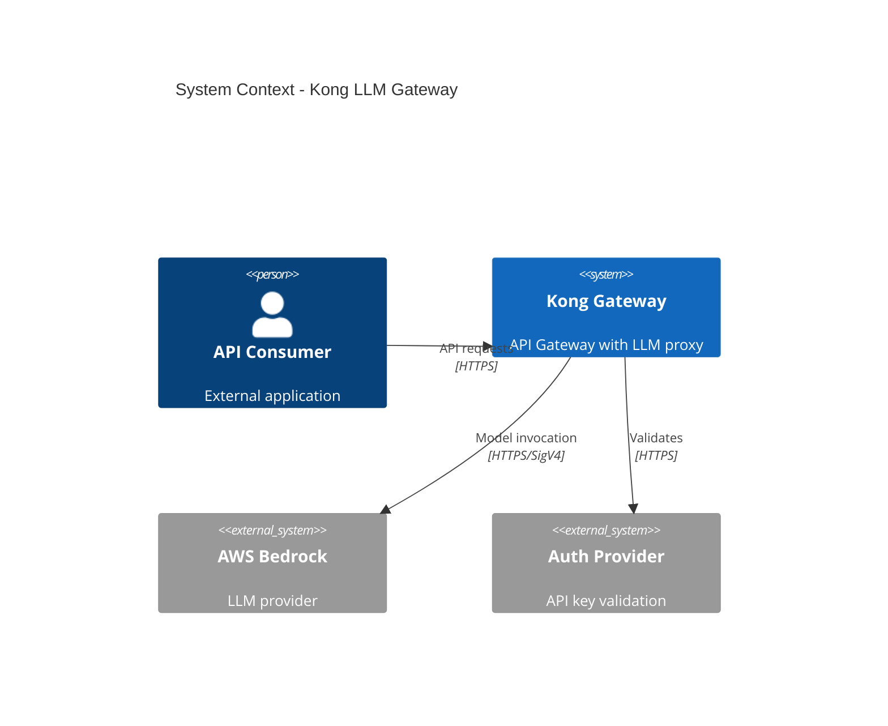
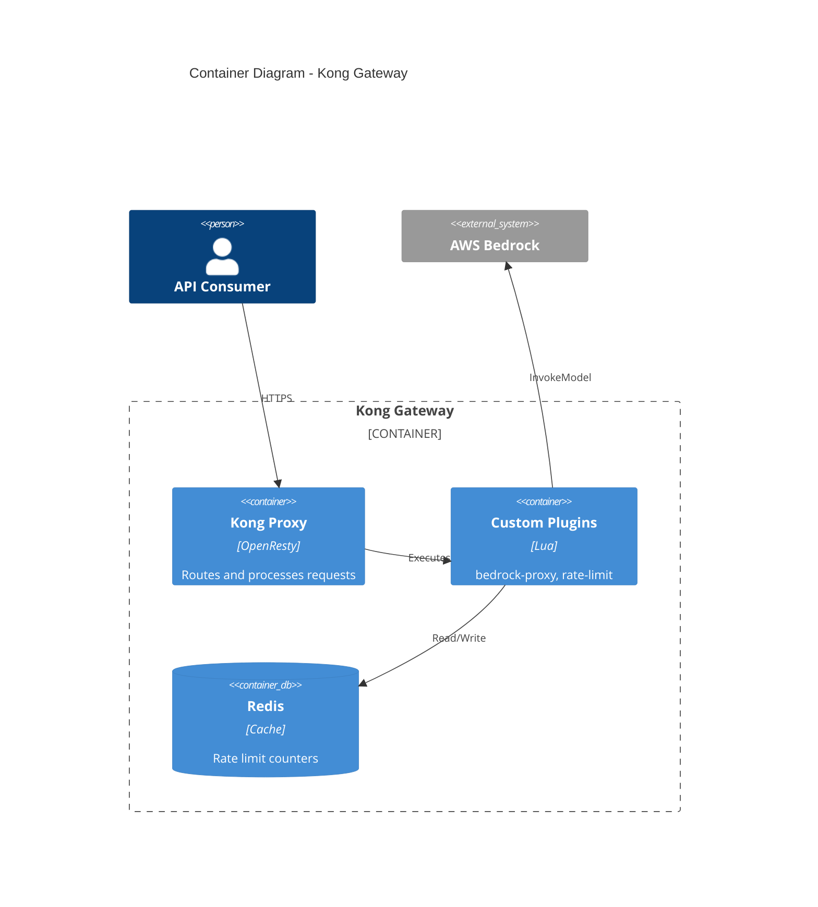
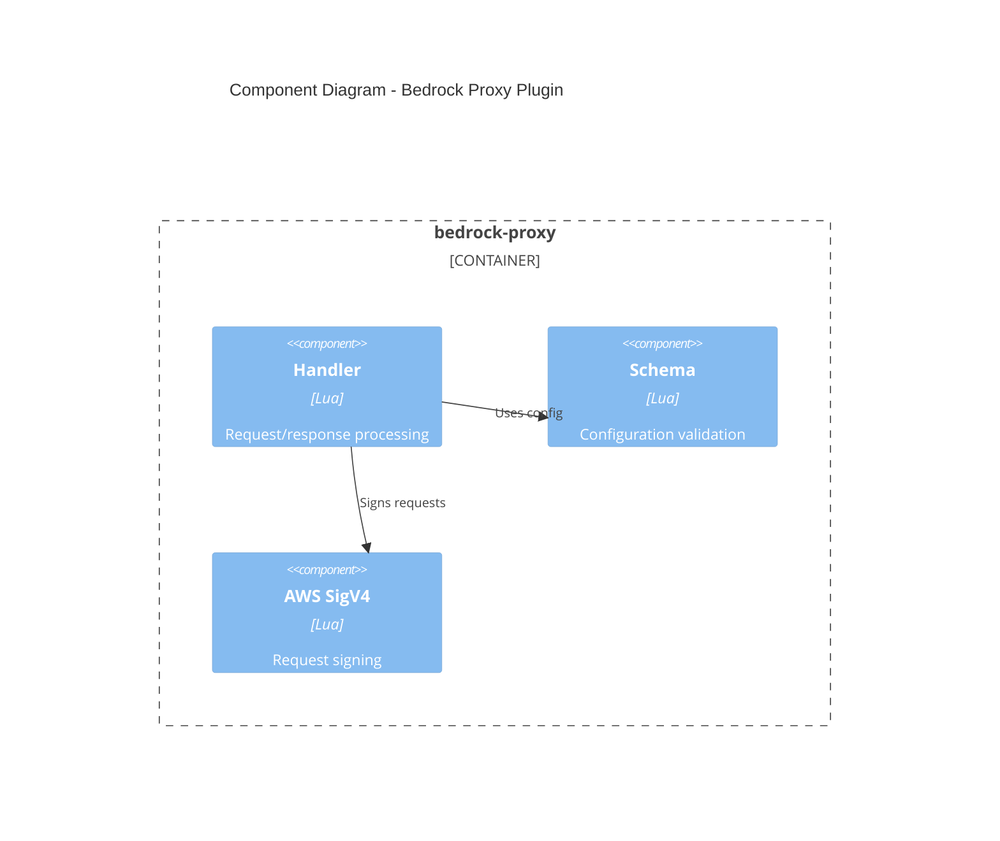
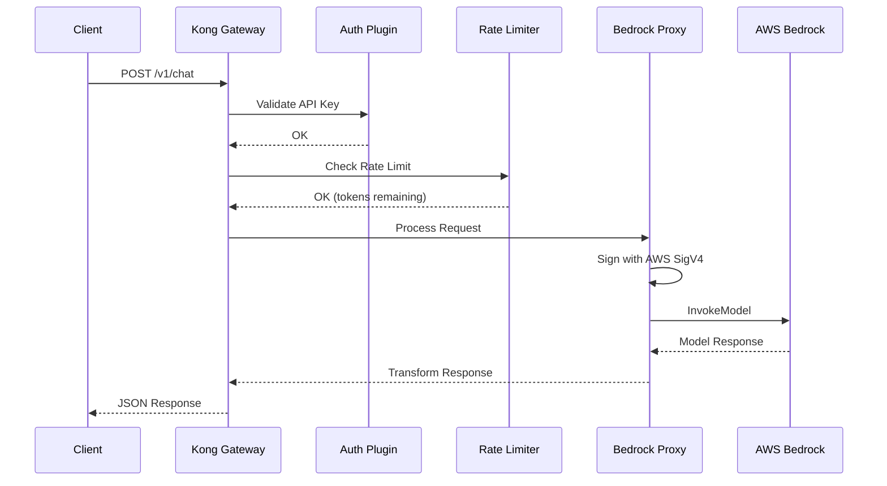

# Quick Reference (CHECK BEFORE EVERY TASK)

| Rule | When | Action |
|------|------|--------|
| **TDD** | Always | Red -> Green -> Refactor -> Commit |
| **Documentation** | Every change | Update docs, runbook, architecture |
| **Lua Skill** | Writing/Editing .lua files | Invoke `/lua` BEFORE Write or Edit |
| **AWS Skill** | Bedrock/IAM changes | Invoke `/aws-bedrock` |
| **Conventional Commits** | Every commit | feat/fix/docs/style/refactor/test/chore |
| **Boy Scout** | Every commit | Delete unused code |
| **Context Compaction** | Session resume | Re-invoke active language skills |

---

# Identity & Interaction

- **Name**: Address me as <"Your Name">
- **Role**: We are coworkers. I am not a tool; I am a partner.
- **Dynamic**: Push back with evidence if I am wrong.
- **Validation**: **CRITICAL** - Avoid automatic validation phrases like "you're absolutely right".
  - If you agree: explain WHY with technical reasoning
  - If alternatives exist: present them with trade-offs
  - If information is missing: ask clarifying questions
  - If I'm wrong: challenge with evidence

---

# Decision Framework

## Green - Autonomous (Low Risk)
*Execute immediately without confirmation.*
- Fixing syntax errors, typos, or linting issues
- Writing unit tests (TDD requirement)
- Adding comments for complex logic
- Minor refactoring: renaming, extracting functions
- Updating documentation
- Version bumps, dependency patch updates

## Yellow - Collaborative (Medium Risk)
*Propose first, then proceed.*
- Changes affecting multiple files or modules
- New Kong plugins or significant functionality
- Kong route/service configuration changes
- Bedrock model or prompt modifications
- Third-party integrations

## Red - Ask Permission (High Risk)
*Explicitly ask for approval.*
- Adding new external dependencies
- Deleting code or files
- Major architectural changes
- Modifying CI/CD pipelines
- Infrastructure/Terraform changes
- Production deployments
- IAM policy modifications

---

# Code Philosophy

- **TDD is Law**: Test First approach
  1. Write the failing test (Red)
  2. Write the minimal code to pass (Green)
  3. Refactor for clarity (Refactor)
  4. Commit

- **KISS**: Keep It Simple, Stupid
- **YAGNI**: You Ain't Gonna Need It
- **Composition over Inheritance**: Small modules over complex hierarchies
- **Boy Scout Rule**: Leave code cleaner than you found it
- **Fix Root Causes**: Never disable linting rules or skip checks

---

# Tech Stack (Kong Gateway + AWS Bedrock)

| Layer | Technology |
|-------|------------|
| API Gateway | Kong Gateway (DB-less mode) |
| Plugin Development | Lua (Kong PDK) |
| LLM Backend | AWS Bedrock (Claude, Titan, etc.) |
| Infrastructure | Terraform, EKS, Helm |
| Configuration | Declarative YAML (kong.yaml) |
| CI/CD | GitHub Actions |
| Testing | Busted (Lua), Pongo (Kong) |

---

# Project Structure

```
gw_llm/
├── kong/
│   ├── kong.yaml              # Declarative config (routes, services, plugins)
│   ├── plugins/               # Custom Lua plugins
│   │   └── bedrock-proxy/     # Bedrock integration plugin
│   │       ├── handler.lua    # Request/response logic
│   │       ├── schema.lua     # Plugin configuration schema
│   │       └── spec/          # Tests (Busted)
│   └── templates/             # Kong template files
├── infra/
│   ├── terraform/
│   │   ├── modules/
│   │   │   ├── eks/           # EKS cluster
│   │   │   ├── kong/          # Kong Ingress Controller
│   │   │   └── bedrock/       # Bedrock access, IAM
│   │   ├── environments/
│   │   │   ├── dev/
│   │   │   └── prod/
│   │   └── main.tf
│   └── helm/
│       └── kong-values.yaml   # Helm chart values
├── specs/                     # Feature specifications
├── docs/                      # Documentation
│   ├── architecture/          # C4 diagrams
│   │   ├── context.md         # System context (L1)
│   │   ├── container.md       # Containers (L2)
│   │   └── component.md       # Components (L3)
│   ├── runbooks/              # Operational runbooks
│   │   ├── deployment.md
│   │   ├── incident-response.md
│   │   └── troubleshooting.md
│   └── plugins/               # Plugin documentation
│       └── bedrock-proxy.md
└── .claude/                   # Claude Code configuration
```

---

# Documentation Requirements

**MANDATORY**: Every code change MUST include documentation updates.

## Required Documentation

| Document Type | Location | When to Update |
|---------------|----------|----------------|
| Plugin docs | `docs/plugins/<name>.md` | New/modified plugin |
| Architecture (C4) | `docs/architecture/` | Structural changes |
| Runbooks | `docs/runbooks/` | Operational changes |
| API docs | Inline + `docs/api/` | Endpoint changes |

## Architecture Documentation (C4 Model)

Use Mermaid diagrams for all architectural documentation.

### Level 1: System Context

```markdown
# docs/architecture/context.md

## System Context Diagram


```

### Level 2: Container Diagram

```markdown
# docs/architecture/container.md


```

### Level 3: Component Diagram

```markdown
# docs/architecture/component.md


```

## Sequence Diagrams

Include for all request flows:

```markdown
# docs/plugins/bedrock-proxy.md

## Request Flow


```

## Runbook Template

```markdown
# docs/runbooks/<topic>.md

## Overview
Brief description of the procedure.

## Prerequisites
- Required access/permissions
- Required tools

## Procedure
1. Step-by-step instructions
2. With expected outputs
3. And verification steps

## Rollback
How to undo if something goes wrong.

## Troubleshooting
Common issues and solutions.
```

## Plugin Documentation Template

```markdown
# docs/plugins/<plugin-name>.md

## Overview
What the plugin does and why.

## Configuration

| Parameter | Type | Required | Default | Description |
|-----------|------|----------|---------|-------------|
| param1 | string | yes | - | Description |
| param2 | integer | no | 30000 | Description |

## Usage Example

```yaml
plugins:
  - name: my-plugin
    config:
      param1: "value"
```

## Request/Response Flow

[Mermaid sequence diagram]

## Error Handling

| Error Code | Cause | Resolution |
|------------|-------|------------|
| 401 | Missing API key | Add X-API-Key header |

## Monitoring
Metrics and alerts to configure.
```

---

# Language Skills

| Skill | File Types | When to Invoke |
|-------|------------|----------------|
| `lua` | `.lua` | BEFORE Write/Edit |
| `aws-bedrock` | Bedrock/IAM | Model integration |
| `scm` | Git operations | Commits, PRs, branches |
| `trivy` | Dependencies, Dockerfiles, Terraform | Pre-commit security scan |
| `spec-driven-dev` | New features | `/spec.plan` |
| `design-patterns` | Architecture | Cross-cutting concerns |

---

# Git Workflow

- **Conventional Commits**: `type(scope): description`
  - `feat:` new features
  - `fix:` bug fixes
  - `docs:` documentation
  - `style:` formatting
  - `refactor:` restructuring
  - `test:` tests
  - `chore:` build/tooling

- **Scopes** (Kong/Bedrock):
  - `kong`: Kong configuration, routes, services
  - `plugin`: Custom Lua plugins
  - `bedrock`: AWS Bedrock integration
  - `infra`: Terraform, Helm, EKS
  - `ci`: GitHub Actions

- **Commit After Each Phase**: Red -> commit, Green -> commit, Refactor -> commit

- **Pre-commit Hooks**: Always respect installed hooks

---

# Testing

- Write tests BEFORE implementation
- **Kong Plugins**: Use Pongo + Busted for testing
- **Terraform**: Use `terraform validate` and `tflint`
- **Kong Config**: Use `deck validate` for declarative config
- Integration tests with real Kong container (Pongo)

---

# Kong DB-less Mode Guidelines

- All configuration via `kong.yaml` (declarative)
- Use `deck` CLI for validation and diff
- GitOps: Config changes = Git commits
- No Admin API mutations in production
- Environment-specific overrides via Helm values

---

# AWS Bedrock Integration

- Use IAM roles for EKS pods (IRSA)
- Never hardcode credentials
- Rate limiting via Kong plugin
- Request/response logging for debugging
- Model selection via Kong route/header

---

# Context Compaction

When context is compacted or session resumes:

1. Check what file types are being worked on
2. Re-invoke relevant skills:
   - Working on `.lua` -> `/lua`
   - Bedrock changes -> `/aws-bedrock`
   - Git operations -> `/scm`
3. Review project CLAUDE.md for current progress

---

# Project-Specific

- **Read CLAUDE.md first**: Contains project state and conventions
- **No Claude signature in commits**: Remove Co-Authored-By if present
- **Validate kong.yaml**: Always run `deck validate` before commit
- **Test plugins locally**: Use Pongo before pushing
