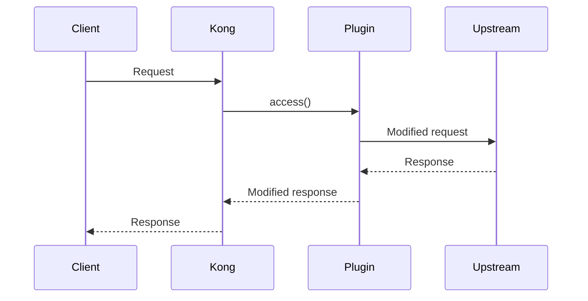

# ABOUTME: Spec-driven development framework for Kong Gateway project
# ABOUTME: Manages lifecycle: /spec.plan -> /spec.refine -> /spec.tasks -> /spec.run

# Spec-Driven Development

Iterative feature development ensuring zero ambiguity before execution.

## Quick Reference

| Command | Purpose |
|---------|---------|
| `/spec.plan <intent>` | Create spec from feature description |
| `/spec.refine [section]` | Improve spec with research |
| `/spec.clarify <response>` | Answer clarification questions |
| `/spec.tasks` | Break spec into executable tasks |
| `/spec.run [task#]` | Execute tasks with TDD |

---

## Core Principle

**Iterate until clarity**: No task execution begins until ALL questions are resolved. Claude must be able to execute without interruptions.

---

## Phase 1: `/spec.plan` - Create Specification

**Trigger**: `/spec.plan <description>` or "I want to build/add X"

### Workflow

1. **Check `specs/` folder** - create if missing
2. **Generate spec file**: `specs/{feature-slug}.md`
3. **Fill initial sections** from user intent
4. **Generate clarifying questions**
5. **STOP and present questions**

### Output

```
Created: specs/feature-name.md (DRAFT)

Questions requiring clarification:
1. [Question about scope]
2. [Question about behavior]

Use /spec.clarify to answer.
```

---

## Phase 2: `/spec.refine` - Research & Improve

**Trigger**: `/spec.refine [section]`

### Workflow

1. Load active DRAFT spec
2. Search codebase for similar patterns
3. Update Technical Strategy
4. Re-evaluate clarity
5. **If questions remain: STOP and present**

---

## Phase 3: `/spec.clarify` - Answer Questions

**Trigger**: `/spec.clarify <response>`

### Example

```
User: /spec.clarify Q1: Use Claude 3.5 Sonnet. Q2: Rate limit per consumer.

Updated specs/bedrock-integration.md:
- Added model selection to Technical Strategy
- Updated rate limiting approach

Remaining questions: None
Spec ready. Use /spec.tasks
```

---

## Phase 4: `/spec.tasks` - Task Breakdown

**Trigger**: `/spec.tasks`

### Prerequisites

- Active spec must be DRAFT or APPROVED
- "Open Questions" section must be empty
- If questions exist: **STOP → /spec.clarify**

### Task Granularity

Tasks should be **high-level logical units**:
- "Implement bedrock-proxy plugin handler"
- "Create AWS SigV4 signing module"
- "Add rate limiting per consumer"
- "Write integration tests"
- "Create plugin documentation"

TDD cycle happens WITHIN each task during `/spec.run`.

---

## Phase 5: `/spec.run` - Execute Tasks

**Trigger**: `/spec.run [task#]`

### Prerequisites

- Task file must exist: `specs/{feature}.tasks.md`
- If no task file: **STOP → /spec.tasks**

### Execution Rules

- **TDD for each task**: Red → Green → Refactor → Commit
- **Invoke language skills**: `/lua` for .lua files
- **Documentation**: Update docs with each change
- **Respect hooks**: Pre-commit must pass
- **Mark completed** in task file

---

## File Structure

```
specs/
├── README.md                       # Project config
├── bedrock-proxy.md                # Spec (APPROVED)
├── bedrock-proxy.tasks.md          # Task breakdown
├── rate-limiting.md                # Spec (DRAFT)
└── ...
```

---

## Spec Status Flow

```
DRAFT -> APPROVED -> IN_PROGRESS -> COMPLETED
          |              |
          v              v
      (questions?)   (blocked?)
          |              |
          v              v
        DRAFT      IN_PROGRESS
```

---

## Kong-Specific Scopes

When creating specs, consider these modules:

| Module | Files | Considerations |
|--------|-------|----------------|
| Plugin Core | `kong/plugins/<name>/handler.lua` | Request phases, PDK usage |
| Schema | `kong/plugins/<name>/schema.lua` | Config validation |
| AWS Integration | Signing, IAM | IRSA, SigV4 |
| Rate Limiting | Redis, counters | Per-consumer, per-route |
| Kong Config | `kong/kong.yaml` | Routes, services, plugins |
| Infrastructure | `infra/terraform/` | EKS, IAM, Helm |

---

## Spec Template (Kong Gateway)

```markdown
# Spec: {Feature Name}

**Status**: DRAFT
**Created**: {YYYY-MM-DD}
**Last Updated**: {YYYY-MM-DD}

---

## 1. Objective

{What are we building and WHY? What value does it provide?}

---

## 2. Requirements

### Functional Requirements

- [ ] FR1: {System must do X when Y happens}
- [ ] FR2: {Plugin handles Z scenario}

### Non-Functional Requirements

- [ ] NFR1: Performance - {e.g., Latency < 100ms added}
- [ ] NFR2: Security - {e.g., No credentials in logs}
- [ ] NFR3: Reliability - {e.g., Graceful degradation}

### Out of Scope

- {Explicitly list what we are NOT building}

---

## 3. Technical Strategy

### Kong Plugin Structure

```
kong/plugins/{name}/
├── handler.lua
├── schema.lua
└── spec/
```

### Request Flow



### Design Decisions

| Decision | Choice | Rationale |
|----------|--------|-----------|
| {Decision 1} | {Choice} | {Why} |

---

## 4. Acceptance Criteria

- [ ] AC1: {Specific, testable criterion}
- [ ] AC2: {Plugin test passes with Pongo}
- [ ] AC3: {Documentation complete}

---

## 5. Open Questions

{Questions that MUST be answered before /spec.tasks}

1. {Question about scope/behavior?}
2. {Question about edge cases?}

---

## 6. Documentation Deliverables

- [ ] Plugin documentation (`docs/plugins/{name}.md`)
- [ ] Architecture diagram (if structural change)
- [ ] Runbook (if operational change)
- [ ] Sequence diagram for request flow

---

## 7. References

- {Link to Kong PDK docs}
- {Link to AWS Bedrock docs}
- {Link to existing plugin code}
```

---

## Session Resume

On context compaction:

1. Check `specs/` for files with status `IN_PROGRESS`
2. Check `.tasks.md` files for unchecked items
3. Report: "Found in-progress spec: X with Y tasks remaining"
4. Ask: "Continue with /spec.run?"
