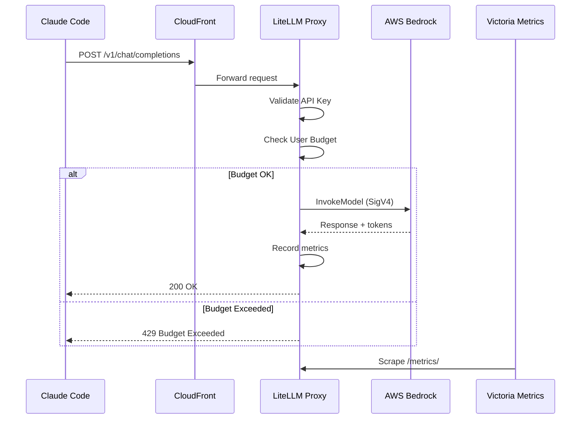
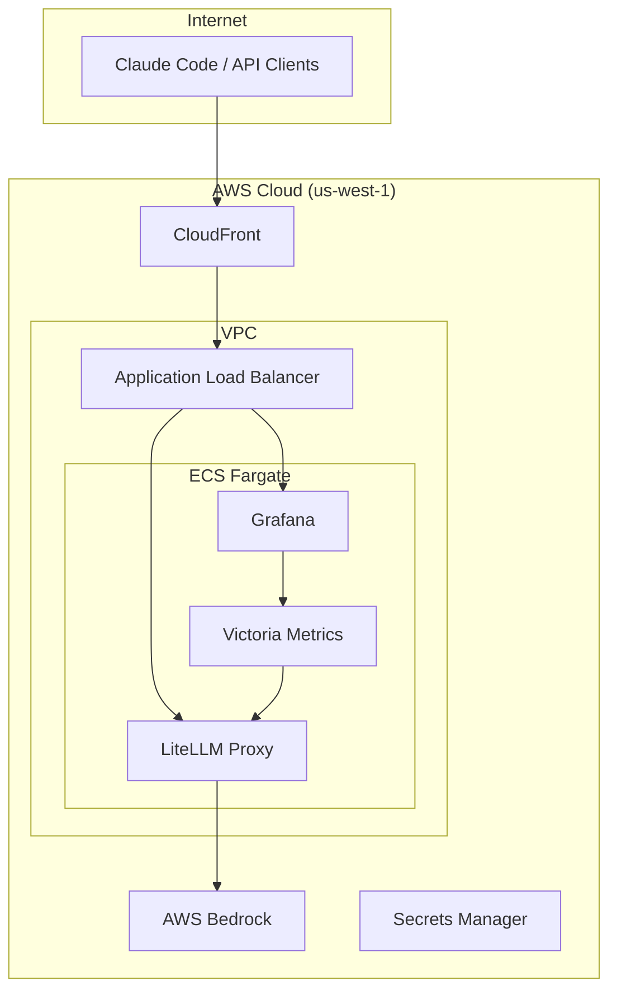

# LiteLLM Gateway for AWS Bedrock


OpenAI-compatible API Gateway for AWS Bedrock with user management, usage tracking, and cost monitoring.

## Table of Contents

- [Overview](#overview)
- [Architecture](#architecture)
- [Quick Start](#quick-start)
- [Configuration](#configuration)
- [Monitoring & Observability](#monitoring--observability)
- [Documentation Index](#documentation-index)
- [API Reference](#api-reference)

---

## Overview

```
┌─────────────────────────────────────────────────────────────────────────────┐
│                          LiteLLM Gateway                                     │
│                                                                              │
│  ┌──────────────┐    ┌──────────────┐    ┌──────────────┐                   │
│  │   API Key    │───▶│    Budget    │───▶│    Model     │                   │
│  │    Auth      │    │   Manager    │    │    Router    │                   │
│  └──────────────┘    └──────────────┘    └──────────────┘                   │
│                                                 │                            │
│                                          ┌──────▼───────┐                   │
│                                          │  Prometheus  │                   │
│                                          │   Metrics    │                   │
│                                          └──────────────┘                   │
└─────────────────────────────────────────────────────────────────────────────┘
                                      │
                    ┌─────────────────┼─────────────────┐
                    ▼                 ▼                 ▼
            ┌──────────────┐  ┌──────────────┐  ┌──────────────┐
            │ Claude Opus  │  │Claude Sonnet │  │ Claude Haiku │
            │   4.5        │  │   4.5        │  │   4.5        │
            └──────────────┘  └──────────────┘  └──────────────┘
```

## Architecture

### Request Flow



### Deployment Architecture



---

## Quick Start

### For Claude Code Users

Add these environment variables to your shell:

```bash
export ANTHROPIC_BASE_URL="https://d18l8nt8fin3hz.cloudfront.net"
export ANTHROPIC_API_KEY="<your-api-key>"
```

Then use Claude Code normally - requests will route through the gateway.

### Test API Access

```bash
# Test with curl
curl -X POST "$ANTHROPIC_BASE_URL/v1/chat/completions" \
  -H "Content-Type: application/json" \
  -H "Authorization: Bearer $ANTHROPIC_API_KEY" \
  -d '{
    "model": "claude-haiku-4-5",
    "messages": [{"role": "user", "content": "Hello!"}],
    "max_tokens": 50
  }'
```

### View Usage Dashboard

Open Grafana at: https://d18l8nt8fin3hz.cloudfront.net/grafana

---

## Configuration

### Available Models

| Model Name | Description | Status |
|------------|-------------|--------|
| `claude-haiku-4-5` | Fast, cost-effective | Working |
| `claude-sonnet-4-5` | Balanced performance | Pending AWS approval |
| `claude-opus-4-5` | Most capable | Pending AWS approval |

### User Management

Users are created via the LiteLLM Admin API:

```bash
# Create user with budget
curl -X POST "$ANTHROPIC_BASE_URL/user/new" \
  -H "Authorization: Bearer <MASTER_KEY>" \
  -H "Content-Type: application/json" \
  -d '{
    "user_email": "user@example.com",
    "max_budget": 10.0,
    "budget_duration": "monthly"
  }'

# Generate API key for user
curl -X POST "$ANTHROPIC_BASE_URL/key/generate" \
  -H "Authorization: Bearer <MASTER_KEY>" \
  -H "Content-Type: application/json" \
  -d '{
    "user_id": "<USER_ID>",
    "key_alias": "user-laptop"
  }'
```

---

## Monitoring & Observability

### Grafana Dashboards

| Dashboard | Purpose |
|-----------|---------|
| LLM Usage Overview | High-level usage statistics |
| LiteLLM Usage | Detailed token tracking |
| Infrastructure | ECS, ALB, CloudFront metrics |

### Key Metrics

```promql
# Total requests
sum(litellm_proxy_total_requests_metric_total)

# Total tokens
sum(litellm_total_tokens_metric_total) by (model)

# Total spend
sum(litellm_spend_metric_total) by (user)

# Latency P95
histogram_quantile(0.95, sum(rate(litellm_llm_api_latency_metric_bucket[5m])) by (le))
```

### Cost Tracking

LiteLLM automatically tracks costs based on model pricing:

| Model | Input ($/1M tokens) | Output ($/1M tokens) |
|-------|---------------------|----------------------|
| Claude Haiku 4.5 | $0.25 | $1.25 |
| Claude Sonnet 4.5 | $3.00 | $15.00 |
| Claude Opus 4.5 | $15.00 | $75.00 |

---

## Documentation Index

### Architecture & Design

| Document | Description |
|----------|-------------|
| [C4 Architecture](docs/architecture/c4-architecture.md) | System context, containers, components diagrams |

### Operations

| Document | Description |
|----------|-------------|
| [High Error Rate Runbook](docs/runbooks/high-error-rate.md) | Troubleshooting 5xx errors |
| [High Latency Runbook](docs/runbooks/high-latency.md) | Diagnosing slow requests |
| [Token Quota Exceeded](docs/runbooks/token-quota-exceeded.md) | Managing token usage |

### Configuration

| Document | Description |
|----------|-------------|
| [Claude Code Config](docs/claude-code-config.md) | Setup guide for Claude Code users |
| [API Examples](docs/examples/curl-examples.md) | curl commands for all endpoints |
| [Proxy & Token Metering](docs/PROXY_TOKEN.md) | How the gateway and token tracking works |

### Infrastructure

| Directory | Description |
|-----------|-------------|
| [infra/terraform](infra/terraform) | Terraform modules and environments |
| [infra/grafana](infra/grafana) | Grafana dashboards and provisioning |
| [infra/README.md](infra/README.md) | Local development with Docker Compose |
| [.github/workflows](.github/workflows) | CI/CD pipelines |

---

## API Reference

### Endpoints

| Endpoint | Method | Description |
|----------|--------|-------------|
| `/v1/chat/completions` | POST | Chat completion (OpenAI-compatible) |
| `/v1/models` | GET | List available models |
| `/health/liveliness` | GET | Health check |
| `/metrics/` | GET | Prometheus metrics |

### Request Format

```json
{
  "model": "claude-haiku-4-5",
  "messages": [
    {"role": "system", "content": "You are a helpful assistant."},
    {"role": "user", "content": "Hello!"}
  ],
  "max_tokens": 1024,
  "temperature": 0.7
}
```

### Authentication

Include API key in Authorization header:
```
Authorization: Bearer <your-api-key>
```

### Error Responses

| Code | Description |
|------|-------------|
| 401 | Invalid or missing API key |
| 429 | Rate limit or budget exceeded |
| 500 | Internal server error |
| 502 | Bedrock service unavailable |

---

## Troubleshooting

### "Unauthorized" error
- Check that ANTHROPIC_API_KEY is set correctly
- Verify the key is valid: `echo $ANTHROPIC_API_KEY`

### "Model not found" error
- Use one of the available model names listed above
- Check available models: `curl -H "Authorization: Bearer $ANTHROPIC_API_KEY" $ANTHROPIC_BASE_URL/v1/models`

### Connection timeout
- Verify ANTHROPIC_BASE_URL is correct
- Test health: `curl $ANTHROPIC_BASE_URL/health/liveliness`

---

## Development

### Local Development

Run the full stack locally with Docker Compose:

```bash
cd infra
cp .env.example .env
# Edit .env with your AWS credentials

docker-compose up -d
```

Local services:
- **LiteLLM**: http://localhost:4000
- **Grafana**: http://localhost:3000 (admin/admin)
- **Victoria Metrics**: http://localhost:8428

### CI/CD

This project uses GitHub Actions for CI/CD:

| Workflow | Description | Trigger |
|----------|-------------|---------|
| `ci.yml` | Security scan, Terraform validate, build, deploy | Push to main |
| `terraform-plan.yml` | Terraform plan with PR comment | Pull requests |

See [`.github/workflows/`](.github/workflows/) for details.

### Contributing

1. Create a feature branch
2. Make changes with tests
3. Run `terraform fmt -recursive` for Terraform files
4. Open a PR - Terraform plan will run automatically
5. Merge after review - CI will deploy to POC

---

## License

MIT License - See [LICENSE](LICENSE) for details.
