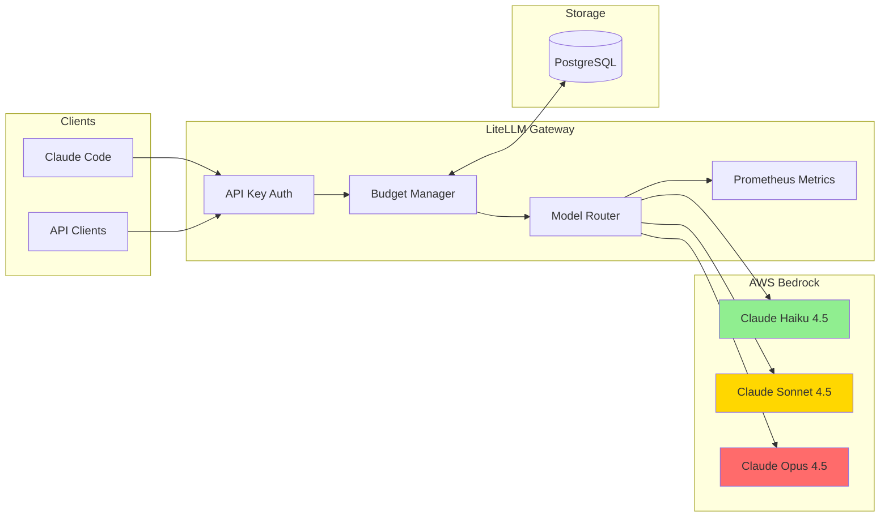
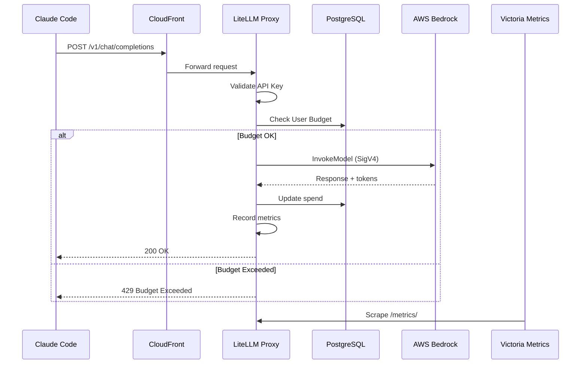
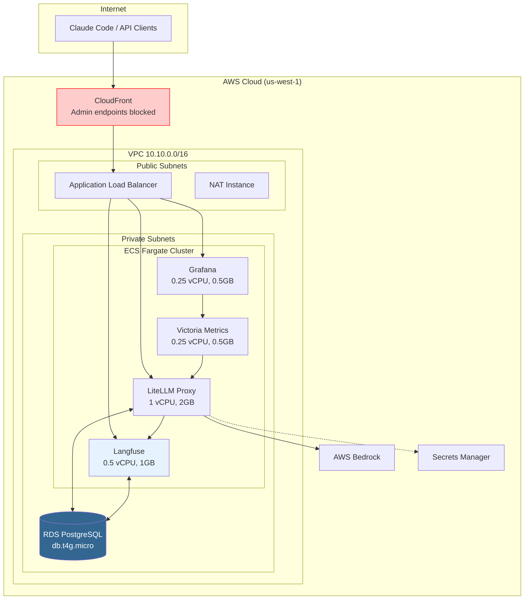
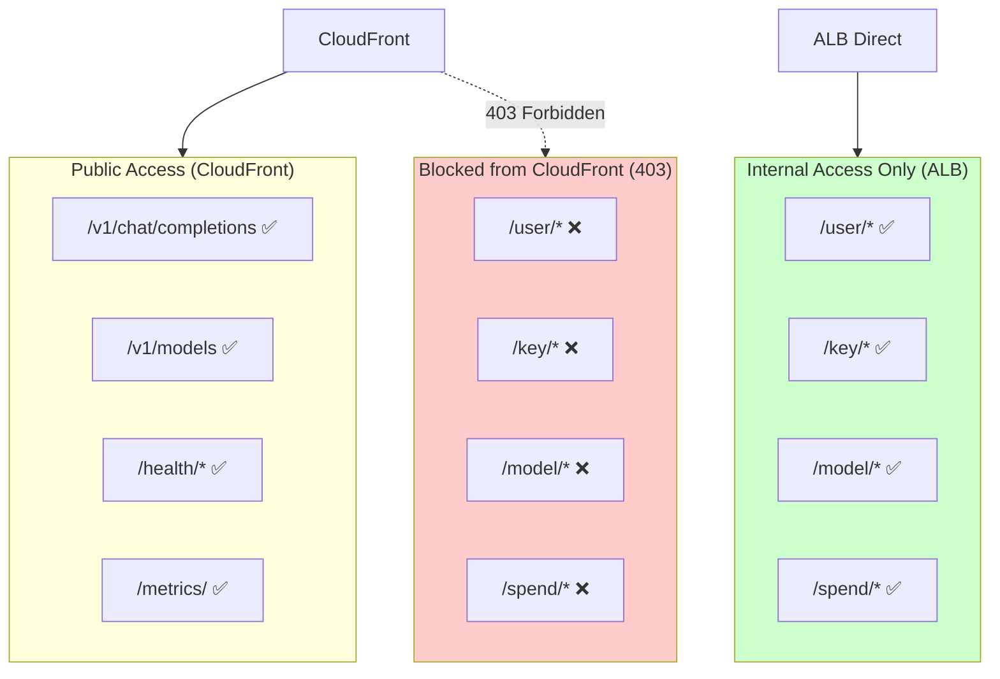
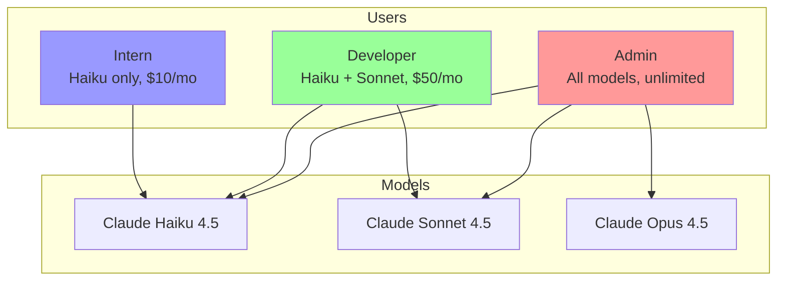
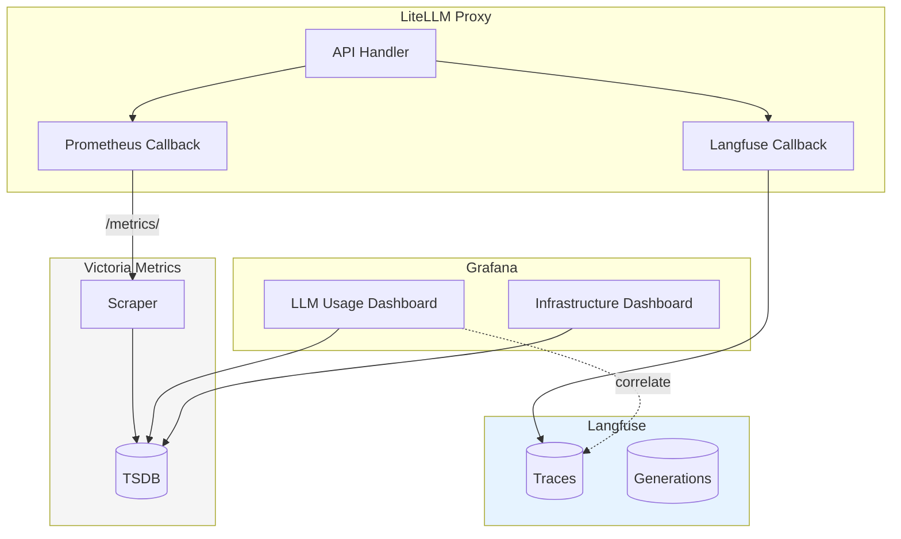
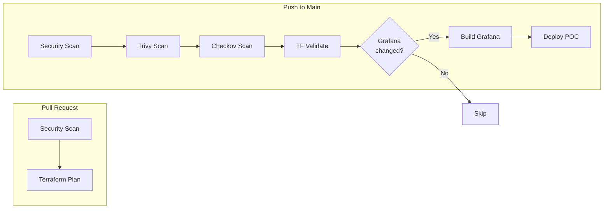

# Stargate LLM Gateway


OpenAI-compatible LLM Gateway for AWS Bedrock with user management, usage tracking, and cost monitoring. Powered by LiteLLM.

## Table of Contents

- [Overview](#overview)
- [Architecture](#architecture)
- [Quick Start](#quick-start)
- [User Management](#user-management)
- [Security](#security)
- [Monitoring & Observability](#monitoring--observability)
- [Documentation Index](#documentation-index)
- [API Reference](#api-reference)

---

## Overview



### Features

| Feature | Status | Description |
|---------|--------|-------------|
| OpenAI-compatible API | ✅ | Drop-in replacement for Claude Code |
| User Management | ✅ | Create users with budgets and model restrictions |
| API Key Generation | ✅ | Per-user API keys with limits |
| Usage Tracking | ✅ | Token and cost tracking per user |
| Prometheus Metrics | ✅ | Full observability stack |
| Langfuse Tracing | ✅ | LLM call logging and analysis |
| Streaming Support | ✅ | SSE for real-time responses |
| Admin Endpoint Security | ✅ | Blocked from public access |

---

## Architecture

### Request Flow



### Deployment Architecture



### Security Model



---

## Quick Start

### For Claude Code Users

Add these environment variables to your shell:

```bash
export ANTHROPIC_BASE_URL="https://d18l8nt8fin3hz.cloudfront.net"
export ANTHROPIC_API_KEY="<your-api-key>"
```

Then use Claude Code normally - requests will route through the gateway.

### Test API Access

```bash
# Test with curl
curl -X POST "$ANTHROPIC_BASE_URL/v1/chat/completions" \
  -H "Content-Type: application/json" \
  -H "Authorization: Bearer $ANTHROPIC_API_KEY" \
  -d '{
    "model": "claude-haiku-4-5",
    "messages": [{"role": "user", "content": "Hello!"}],
    "max_tokens": 50
  }'
```


### View Dashboards

| Dashboard | URL |
|-----------|-----|
| **Grafana** (Metrics) | https://d18l8nt8fin3hz.cloudfront.net/grafana |
| **Langfuse** (Traces) | https://d18l8nt8fin3hz.cloudfront.net/langfuse/ |

---

## User Management

### Using the Management Script

```bash
cd scripts/

# Show help
./litellm-users.sh help

# Create a user with budget
./litellm-users.sh create-user --email user@example.com --budget 50 --duration monthly

# Create API key with model restrictions
./litellm-users.sh create-key --alias "haiku-only" --models '["claude-haiku-4-5"]' --budget 10

# List users and keys
./litellm-users.sh list-users
./litellm-users.sh list-keys
```

### Available Models

| Model Name | Description | Status |
|------------|-------------|--------|
| `claude-haiku-4-5` | Fast, cost-effective | ✅ Working |
| `claude-sonnet-4-5` | Balanced performance | ⚠️ Pending AWS approval |
| `claude-opus-4-5` | Most capable | ⚠️ Pending AWS approval |

### Model-User Restrictions



See [User Management Guide](docs/user-management.md) for full documentation.

---

## Security

### Admin Endpoint Protection

Admin endpoints are **blocked from CloudFront** and only accessible via ALB direct (from VPC):

| Endpoint | CloudFront | ALB Direct |
|----------|------------|------------|
| `/v1/chat/completions` | ✅ Works | ✅ Works |
| `/v1/models` | ✅ Works | ✅ Works |
| `/user/*` | ❌ 403 Forbidden | ✅ Works |
| `/key/*` | ❌ 403 Forbidden | ✅ Works |
| `/model/*` | ❌ 403 Forbidden | ✅ Works |
| `/spend/*` | ❌ 403 Forbidden | ✅ Works |

### Managing Users from VPC

```bash
# Via ALB direct (from VPC/VPN)
curl -X POST "http://kong-llm-gateway-poc-xxx.us-west-1.elb.amazonaws.com/user/new" \
  -H "Authorization: Bearer $MASTER_KEY" \
  -d '{"user_email":"user@example.com","max_budget":10}'

# Via CloudFront (blocked)
curl -X POST "https://d18l8nt8fin3hz.cloudfront.net/user/new"
# Returns: 403 Forbidden - Admin endpoints not accessible via CloudFront
```

---

## Monitoring & Observability

### Observability Stack (Verified ✅)



### Dashboards

| Dashboard | Purpose | URL | Status |
|-----------|---------|-----|--------|
| **Grafana** - LLM Usage | Token tracking, costs, latency | `/grafana` | ✅ Working |
| **Grafana** - Infrastructure | ECS, ALB, CloudFront, Langfuse, Victoria Metrics | `/grafana` | ✅ Working |
| **Langfuse** - Traces | Request/response logging | `/langfuse/` | ✅ Working |
| **Langfuse** - Generations | LLM call analysis | `/langfuse/` | ✅ Working |

#### Grafana - Infrastructure Metrics


#### Grafana - Token Usage & Costs


#### Grafana - Architecture Flow


#### Grafana - PostgreSQL Metrics


#### Langfuse - LLM Traces


### Metrics & Traces Integration

Grafana dashboards correlate Prometheus metrics with Langfuse traces:

| Data Source | Metrics | Use Case |
|-------------|---------|----------|
| **Victoria Metrics** | `litellm_proxy_total_requests_metric` | Request counts per user |
| **Victoria Metrics** | `litellm_total_tokens_metric` | Token usage tracking |
| **Victoria Metrics** | `litellm_spend_metric` | Cost monitoring |
| **Langfuse** | Traces | Full request/response logging |
| **Langfuse** | Generations | LLM call details and metadata |

### Key Metrics

```promql
# Total requests
sum(litellm_proxy_total_requests_metric_total)

# Total tokens by model
sum(litellm_total_tokens_metric_total) by (model)

# Total spend by user
sum(litellm_spend_metric_total) by (user)

# Latency P95
histogram_quantile(0.95, sum(rate(litellm_llm_api_latency_metric_bucket[5m])) by (le))
```

### Cost Tracking

| Model | Input ($/1M tokens) | Output ($/1M tokens) |
|-------|---------------------|----------------------|
| Claude Haiku 4.5 | $0.80 | $4.00 |
| Claude Sonnet 4.5 | $3.00 | $15.00 |
| Claude Opus 4.5 | $15.00 | $75.00 |

---

## Documentation Index

### Architecture & Design

| Document | Description |
|----------|-------------|
| [C4 Architecture](docs/architecture/c4-architecture.md) | System context, containers, components diagrams |

### Observability

| Document | Description |
|----------|-------------|
| [Langfuse Integration](docs/langfuse.md) | LLM tracing, call logging, and analysis |

### Operations

| Document | Description |
|----------|-------------|
| [User Management](docs/user-management.md) | Create users, API keys, budgets |
| [High Error Rate Runbook](docs/runbooks/high-error-rate.md) | Troubleshooting 5xx errors |
| [High Latency Runbook](docs/runbooks/high-latency.md) | Diagnosing slow requests |
| [Token Quota Exceeded](docs/runbooks/token-quota-exceeded.md) | Managing token usage |

### Configuration

| Document | Description |
|----------|-------------|
| [Claude Code Config](docs/claude-code-config.md) | Setup guide for Claude Code users |
| [API Examples](docs/examples/curl-examples.md) | curl commands for all endpoints |
| [Proxy & Token Metering](docs/PROXY_TOKEN.md) | How the gateway and token tracking works |

### Infrastructure

| Directory | Description |
|-----------|-------------|
| [infra/terraform](infra/terraform) | Terraform modules and environments |
| [infra/grafana](infra/grafana) | Grafana dashboards and provisioning |
| [infra/README.md](infra/README.md) | Local development with Docker Compose |
| [scripts/](scripts/) | User management scripts |

### GitHub Actions

| Workflow | Description |
|----------|-------------|
| [ci.yml](.github/workflows/ci.yml) | CI pipeline: security, validate, build, deploy |
| [terraform-plan.yml](.github/workflows/terraform-plan.yml) | Terraform plan on PRs |
| [ecs-restart.yml](.github/workflows/ecs-restart.yml) | Restart ECS services |
| [ecs-logs.yml](.github/workflows/ecs-logs.yml) | Download container logs |
| [ecs-status.yml](.github/workflows/ecs-status.yml) | View cluster status |
| [ecs-scale.yml](.github/workflows/ecs-scale.yml) | Scale ECS services |
| [ecs-exec.yml](.github/workflows/ecs-exec.yml) | Execute commands in containers |
| [rds-status.yml](.github/workflows/rds-status.yml) | Database status and metrics |

---

## API Reference

### Endpoints

| Endpoint | Method | Access | Description |
|----------|--------|--------|-------------|
| `/v1/chat/completions` | POST | Public | Chat completion (OpenAI-compatible) |
| `/v1/models` | GET | Public | List available models |
| `/health/liveliness` | GET | Public | Health check |
| `/metrics/` | GET | Public | Prometheus metrics |
| `/user/*` | * | Internal | User management |
| `/key/*` | * | Internal | API key management |

### Request Format

```json
{
  "model": "claude-haiku-4-5",
  "messages": [
    {"role": "system", "content": "You are a helpful assistant."},
    {"role": "user", "content": "Hello!"}
  ],
  "max_tokens": 1024,
  "temperature": 0.7,
  "stream": false
}
```

### Authentication

Include API key in Authorization header:
```
Authorization: Bearer <your-api-key>
```

### Error Responses

| Code | Description |
|------|-------------|
| 401 | Invalid or missing API key |
| 403 | Admin endpoint blocked (use ALB) |
| 429 | Rate limit or budget exceeded |
| 500 | Internal server error |
| 502 | Bedrock service unavailable |

---

## Development

### Local Development

Run the full stack locally with Docker Compose:

```bash
cd infra
cp .env.example .env
# Edit .env with your AWS credentials

docker-compose up -d
```

Local services:
- **LiteLLM**: http://localhost:4000
- **Grafana**: http://localhost:3000 (admin/admin)
- **Victoria Metrics**: http://localhost:8428

### CI/CD Pipeline



| Workflow | Description | Trigger |
|----------|-------------|---------|
| `ci.yml` | Security scan, Terraform validate, build, deploy | Push to main |
| `terraform-plan.yml` | Terraform plan with PR comment | Pull requests |


### Operational Workflows (Manual)

| Workflow | Description | Inputs |
|----------|-------------|--------|
| `ecs-restart.yml` | Restart ECS services | service (or all) |
| `ecs-logs.yml` | Download container logs | service, duration, filter |
| `ecs-status.yml` | View cluster status | - |
| `ecs-scale.yml` | Scale services (0-3 tasks) | service, count |
| `ecs-exec.yml` | Execute debug commands | service, command |
| `rds-status.yml` | Database metrics | - |

> **Note**: Operational workflows require `poc` environment approval for security.

### Estimated Costs

| Component | Monthly Cost |
|-----------|--------------|
| ECS Fargate (LiteLLM + Langfuse + Grafana + Victoria) | ~$55 |
| RDS PostgreSQL (db.t4g.micro) | ~$12 |
| NAT Instance (t3.nano) | ~$3 |
| CloudFront | ~$1-5 |
| **Total Fixed** | **~$70-75** |
| Bedrock Usage | Pay per use |

---

## License

MIT License - See [LICENSE](LICENSE) for details.
