# Kong LLM Gateway for AWS Bedrock

Enterprise-grade API Gateway for AWS Bedrock with RBAC, token metering, cost tracking, and content guardrails.

## Table of Contents

- [Overview](#overview)
- [Architecture](#architecture)
- [Quick Start](#quick-start)
- [How It Works](#how-it-works)
- [RBAC Model](#rbac-model)
- [Monitoring & Observability](#monitoring--observability)
  - [Token Usage & Cost Tracking](#token-usage--cost-tracking)
  - [Rule Violations](#monitoring-rule-violations)
- [Content Guardrails](#content-guardrails)
  - [Adding Custom Rules](#adding-custom-rules)
- [Documentation Index](#documentation-index)
- [API Reference](#api-reference)

---

## Overview

```
┌─────────────────────────────────────────────────────────────────────────────┐
│                           Kong LLM Gateway                                   │
│                                                                             │
│  ┌──────────┐    ┌──────────────┐    ┌──────────────┐    ┌──────────────┐  │
│  │   Auth   │───▶│  Rate Limit  │───▶│  Guardrails  │───▶│   Bedrock    │  │
│  │ (API Key)│    │(tokens/cost) │    │ (PCI/GDPR)   │    │    Proxy     │  │
│  └──────────┘    └──────────────┘    └──────────────┘    └──────────────┘  │
│                                                                 │           │
│                                                          ┌──────▼───────┐  │
│                                                          │ Token Meter  │  │
│                                                          │(usage/costs) │  │
│                                                          └──────────────┘  │
└─────────────────────────────────────────────────────────────────────────────┘
                                      │
                    ┌─────────────────┼─────────────────┐
                    ▼                 ▼                 ▼
            ┌──────────────┐  ┌──────────────┐  ┌──────────────┐
            │ Claude Opus  │  │Claude Sonnet │  │ Claude Haiku │
            │   (complex)  │  │  (balanced)  │  │    (fast)    │
            └──────────────┘  └──────────────┘  └──────────────┘
```

## Architecture

### Request Flow

```mermaid
sequenceDiagram
    participant Client
    participant Kong
    participant Auth
    participant RateLimit
    participant Guardrails
    participant BedrockProxy
    participant TokenMeter
    participant Bedrock
    participant Prometheus

    Client->>Kong: POST /v1/chat/developer
    Kong->>Auth: Validate API Key
    Auth-->>Kong: ✓ Consumer: developer-team

    Kong->>RateLimit: Check limits
    RateLimit-->>Kong: ✓ 5/10 req/s used

    Kong->>Guardrails: Scan content

    alt Content Blocked
        Guardrails-->>Client: 403 Forbidden
        Guardrails->>Prometheus: guardrail_blocks++
    else Content OK
        Guardrails-->>Kong: ✓ Clean
    end

    Kong->>BedrockProxy: Transform & Route
    BedrockProxy->>Bedrock: InvokeModel (SigV4)
    Bedrock-->>BedrockProxy: Response + tokens

    BedrockProxy->>TokenMeter: Track usage
    TokenMeter->>Prometheus: tokens_total++
    TokenMeter->>Prometheus: cost_total++

    TokenMeter-->>Client: Response + X-Token-* headers
```



### Deployment Architecture


---

## Quick Start

### Local Development

```bash
# Start the stack
make local/up

# Test with API call
curl -X POST http://localhost:8000/v1/chat/developer \
  -H "Content-Type: application/json" \
  -H "apikey: developer-key-12345" \
  -d '{
    "model": "claude-haiku",
    "messages": [{"role": "user", "content": "Hello!"}],
    "max_tokens": 100
  }'

# View dashboards
open http://localhost:3001  # Grafana
open http://localhost:9090  # Prometheus
```

### EKS Deployment

```bash
# 1. Deploy infrastructure
make terraform/init ENV=dev
make terraform/apply ENV=dev

# 2. Configure kubectl
aws eks update-kubeconfig --name kong-llm-gateway-dev --region us-east-1

# 3. Deploy Kong
make eks/deploy ENV=dev
```

---

## How It Works

### Request Processing Pipeline


### Model Routing by Role

```mermaid
flowchart TB
    subgraph Consumers
        admin[Admin]
        dev[Developer]
        analyst[Analyst]
        ops[Ops]
        guest[Guest]
    end

    subgraph Routes
        r_admin[/v1/chat/admin]
        r_dev[/v1/chat/developer]
        r_analyst[/v1/chat/analyst]
        r_ops[/v1/chat/ops]
        r_guest[/v1/chat/guest]
    end

    subgraph Models
        opus[Claude Opus<br/>$15/M input]
        sonnet[Claude Sonnet<br/>$3/M input]
        haiku[Claude Haiku<br/>$0.25/M input]
        titan[Titan Text<br/>$0.30/M input]
    end

    admin --> r_admin --> opus & sonnet & haiku & titan
    dev --> r_dev --> sonnet & haiku
    analyst --> r_analyst --> haiku & titan
    ops --> r_ops --> haiku
    guest --> r_guest --> haiku

    style opus fill:#ff6b6b
    style sonnet fill:#4ecdc4
    style haiku fill:#95e1d3
    style titan fill:#f7dc6f
```

---

## RBAC Model

| Role | Rate Limit | Token Limit | Models | Use Case |
|------|------------|-------------|--------|----------|
| **Admin** | Unlimited | Unlimited | All | Full access, debugging |
| **Developer** | 10 req/s | 100K/day | Sonnet, Haiku | Feature development |
| **Analyst** | 5 req/s | 50K/day | Haiku, Titan | Data analysis |
| **Ops** | 3 req/s | 20K/day | Haiku | Product descriptions |
| **Guest** | 1 req/s | 1K/day | Haiku | Limited demo access |

---

## Monitoring & Observability

### Token Usage & Cost Tracking

The gateway tracks every request and provides detailed metrics.

#### Response Headers

Every response includes token usage information:

```bash
curl -v -X POST http://localhost:8000/v1/chat/developer \
  -H "apikey: developer-key-12345" \
  -H "Content-Type: application/json" \
  -d '{"model":"claude-haiku","messages":[{"role":"user","content":"Hi"}],"max_tokens":50}'
```

Response headers:
```
X-Token-Input: 12
X-Token-Output: 35
X-Token-Total: 47
X-Token-Cost-USD: 0.000047
X-Model-Used: anthropic.claude-3-haiku-20240307-v1:0
X-RateLimit-Remaining: 9
```

#### Grafana Dashboard

```mermaid
flowchart TB
    subgraph "Token Usage Dashboard"
        direction TB

        subgraph "Overview Row"
            total_req[Total Requests<br/>📊 12,456]
            total_tokens[Total Tokens<br/>📈 2.3M]
            total_cost[Total Cost<br/>💰 $45.67]
            error_rate[Error Rate<br/>⚠️ 0.12%]
        end

        subgraph "Usage by Consumer"
            chart1[Bar Chart:<br/>Tokens per Consumer]
        end

        subgraph "Usage by Model"
            chart2[Pie Chart:<br/>Cost Distribution]
        end

        subgraph "Time Series"
            chart3[Line Chart:<br/>Tokens over Time]
        end
    end
```



Access Grafana at `http://localhost:3001` (local) or your Grafana URL (EKS).

#### Prometheus Queries

```promql
# Total tokens used (last 24h)
sum(increase(kong_llm_tokens_total[24h])) by (consumer)

# Cost by model
sum(kong_llm_cost_total) by (model)

# Token usage rate
sum(rate(kong_llm_tokens_total[5m])) by (consumer)

# Top 10 consumers by usage
topk(10, sum(increase(kong_llm_tokens_total[1h])) by (consumer))
```

#### Cost Tracking Flow


**Model Pricing Reference:**

| Model | Input ($/1M tokens) | Output ($/1M tokens) |
|-------|---------------------|----------------------|
| Claude Opus | $15.00 | $75.00 |
| Claude Sonnet | $3.00 | $15.00 |
| Claude Haiku | $0.25 | $1.25 |
| Titan Text | $0.30 | $0.40 |

---

### Monitoring Rule Violations

#### Violation Tracking Flow


#### Prometheus Queries for Violations

```promql
# Total violations by category
sum(kong_guardrail_blocks_total) by (category)

# Violation rate by consumer
sum(rate(kong_guardrail_blocks_total[1h])) by (consumer)

# Critical violations (requires immediate attention)
sum(kong_guardrail_blocks_total{severity="critical"}) by (category)

# Violations trend (for anomaly detection)
sum(increase(kong_guardrail_blocks_total[1h]))
```

#### Grafana Violations Panel

```mermaid
flowchart TB
    subgraph "Security Violations Dashboard"
        direction TB

        subgraph "Summary"
            total[Total Blocks<br/>🛡️ 234]
            critical[Critical<br/>🔴 12]
            high[High<br/>🟠 45]
        end

        subgraph "By Category"
            cat_chart[Stacked Bar:<br/>sql_injection: 56<br/>pci_dss: 89<br/>credentials: 34<br/>exploit: 23<br/>pii: 32]
        end

        subgraph "By Consumer"
            consumer_chart[Table:<br/>Who triggered violations]
        end

        subgraph "Timeline"
            timeline[Time series:<br/>Violations over time]
        end
    end
```



#### Log Analysis

Violations are logged in JSON format for easy analysis:

```json
{
  "event": "guardrail_violation",
  "category": "pci_dss",
  "severity": "critical",
  "pattern": "%d%d%d%d[%s%-]?%d%d%d%d...",
  "consumer": "developer-team",
  "route": "developer-chat",
  "timestamp": "2024-01-15T10:30:00Z"
}
```

Query logs with:
```bash
# Kubernetes
kubectl logs -n kong -l app.kubernetes.io/name=kong | \
  jq 'select(.event == "guardrail_violation")'

# Count by category
kubectl logs -n kong -l app.kubernetes.io/name=kong | \
  jq -r 'select(.event == "guardrail_violation") | .category' | \
  sort | uniq -c
```

---

## Content Guardrails

### Built-in Rules

The gateway includes pre-configured rules for common security patterns:

| Category | Examples | Severity |
|----------|----------|----------|
| **SQL Injection** | `SELECT * FROM`, `DROP TABLE` | Critical |
| **PCI-DSS** | Credit card numbers, CVV | Critical/High |
| **Credentials** | Passwords, API keys, tokens | High |
| **Exploits** | `<script>`, XSS patterns | Critical |
| **PII** | SSN, passport numbers | Critical |

### Adding Custom Rules

Custom rules can be added via the Kong configuration (`kong.yaml`) or dynamically through the Admin API.

#### Method 1: Kong Configuration (Recommended)

Edit `kong/kong.yaml` to add custom patterns:

```yaml
plugins:
  - name: ecommerce-guardrails
    service: bedrock-service
    config:
      use_default_patterns: true
      min_severity: medium
      block_on_violation: true
      block_status_code: 403
      block_message: "Request blocked by security policy"
      # Add custom patterns as JSON array
      custom_patterns: |
        [
          {
            "pattern": "competitor%s*name",
            "category": "business",
            "severity": "medium"
          },
          {
            "pattern": "internal%s*only",
            "category": "confidential",
            "severity": "high"
          },
          {
            "pattern": "bitcoin|ethereum|crypto",
            "category": "prohibited_topic",
            "severity": "medium"
          }
        ]
```

#### Method 2: Per-Route Rules

Apply different rules to different routes:

```yaml
# Developer route - strict rules
- name: guardrails-developer
  route: developer-chat
  config:
    min_severity: low
    custom_patterns: |
      [
        {"pattern": "production%s*database", "category": "security", "severity": "critical"},
        {"pattern": "admin%s*password", "category": "security", "severity": "critical"}
      ]

# Guest route - very strict rules
- name: guardrails-guest
  route: guest-chat
  config:
    min_severity: low
    custom_patterns: |
      [
        {"pattern": "hack", "category": "prohibited", "severity": "low"},
        {"pattern": "jailbreak", "category": "prohibited", "severity": "low"},
        {"pattern": "ignore%s*previous", "category": "prompt_injection", "severity": "critical"}
      ]
```

#### Pattern Syntax

Patterns use Lua pattern matching (similar to regex):

| Pattern | Matches |
|---------|---------|
| `%s` | Any whitespace |
| `%d` | Any digit |
| `%w` | Any alphanumeric |
| `%a` | Any letter |
| `.` | Any character |
| `*` | Zero or more |
| `+` | One or more |
| `?` | Zero or one |
| `[abc]` | Character class |
| `[^abc]` | Negated class |

#### Example: Block Specific Keywords

```yaml
custom_patterns: |
  [
    {
      "pattern": "forbidden%s*word",
      "category": "keyword_block",
      "severity": "high"
    },
    {
      "pattern": "competitor1|competitor2|competitor3",
      "category": "competitor_mention",
      "severity": "medium"
    },
    {
      "pattern": "price%s*match",
      "category": "pricing",
      "severity": "low"
    }
  ]
```

#### Example: Block Prompt Injection Attempts

```yaml
custom_patterns: |
  [
    {
      "pattern": "ignore%s*all%s*previous",
      "category": "prompt_injection",
      "severity": "critical"
    },
    {
      "pattern": "disregard%s*instructions",
      "category": "prompt_injection",
      "severity": "critical"
    },
    {
      "pattern": "you%s*are%s*now",
      "category": "prompt_injection",
      "severity": "high"
    },
    {
      "pattern": "act%s*as%s*if",
      "category": "prompt_injection",
      "severity": "high"
    },
    {
      "pattern": "pretend%s*you%s*are",
      "category": "prompt_injection",
      "severity": "high"
    }
  ]
```

#### Apply Configuration Changes

```bash
# Local development
make local/reload

# EKS (via ArgoCD)
git add kong/kong.yaml
git commit -m "feat: add custom guardrail rules"
git push
# ArgoCD will auto-sync

# EKS (manual)
kubectl create configmap kong-declarative-config \
  --from-file=kong.yaml=kong/kong.yaml \
  -n kong --dry-run=client -o yaml | kubectl apply -f -
kubectl rollout restart deployment -n kong kong-kong
```

#### Testing Custom Rules

```bash
# Test keyword blocking
curl -X POST http://localhost:8000/v1/chat/developer \
  -H "apikey: developer-key-12345" \
  -H "Content-Type: application/json" \
  -d '{
    "model": "claude-haiku",
    "messages": [{"role": "user", "content": "Tell me about forbidden word"}],
    "max_tokens": 100
  }'

# Expected response:
# HTTP 403 Forbidden
# {"error":{"code":"GUARDRAIL_VIOLATION","category":"keyword_block","message":"Request blocked by security policy"}}
```

---

## Documentation Index

### Architecture & Design

| Document | Description |
|----------|-------------|
| [C4 Architecture](docs/architecture/c4-architecture.md) | System context, containers, components diagrams |

### Operations

| Document | Description |
|----------|-------------|
| [High Error Rate Runbook](docs/runbooks/high-error-rate.md) | Troubleshooting 5xx errors |
| [High Latency Runbook](docs/runbooks/high-latency.md) | Diagnosing slow requests |
| [Token Quota Exceeded](docs/runbooks/token-quota-exceeded.md) | Managing token usage |

### Development

| Document | Description |
|----------|-------------|
| [API Examples](docs/examples/curl-examples.md) | curl commands for all endpoints |
| [CLAUDE.md](.claude/CLAUDE.md) | Development conventions |
| [status.md](.claude/status.md) | Project context and RBAC model |

### Infrastructure

| Directory | Description |
|-----------|-------------|
| [infra/terraform](infra/terraform) | EKS, IAM, Kong Terraform modules |
| [infra/helm](infra/helm) | Kong Helm values (base, dev, prod) |
| [infra/argocd](infra/argocd) | ArgoCD Application manifests |
| [infra/observability](infra/observability) | Prometheus, Grafana, Datadog configs |

---

## API Reference

### Endpoints

| Endpoint | Role | Models |
|----------|------|--------|
| `POST /v1/chat/admin` | Admin | All |
| `POST /v1/chat/developer` | Developer | Sonnet, Haiku |
| `POST /v1/chat/analyst` | Analyst | Haiku, Titan |
| `POST /v1/chat/ops` | Ops | Haiku |
| `POST /v1/chat/guest` | Guest | Haiku |

### Request Format

```json
{
  "model": "claude-haiku",
  "messages": [
    {"role": "system", "content": "You are a helpful assistant."},
    {"role": "user", "content": "Hello!"}
  ],
  "max_tokens": 1024,
  "temperature": 0.7,
  "stream": false
}
```

### Authentication

Include API key in header:
```
apikey: your-api-key-here
```

### Response Headers

| Header | Description |
|--------|-------------|
| `X-Token-Input` | Input tokens used |
| `X-Token-Output` | Output tokens generated |
| `X-Token-Total` | Total tokens |
| `X-Token-Cost-USD` | Estimated cost |
| `X-Model-Used` | Bedrock model ID |
| `X-RateLimit-Remaining` | Requests remaining |
| `X-Guardrails-Enabled` | Guardrails active |

---

## Contributing

1. Fork the repository
2. Create a feature branch
3. Follow TDD methodology (write tests first)
4. Use conventional commits
5. Submit a pull request

## License

MIT License - See [LICENSE](LICENSE) for details.
