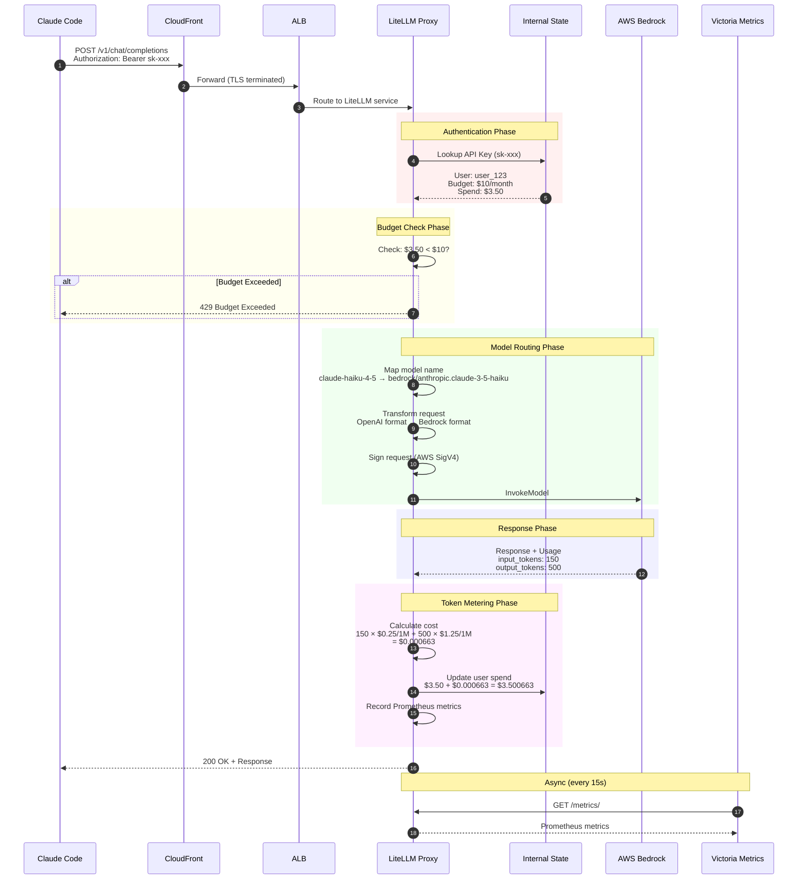
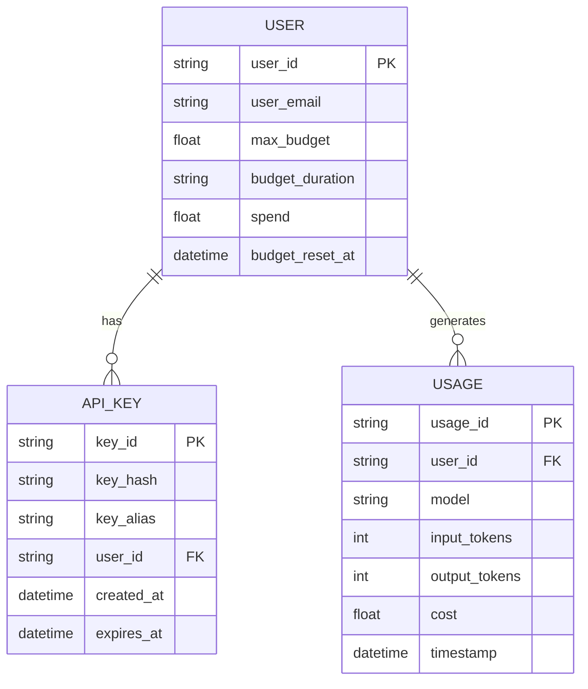
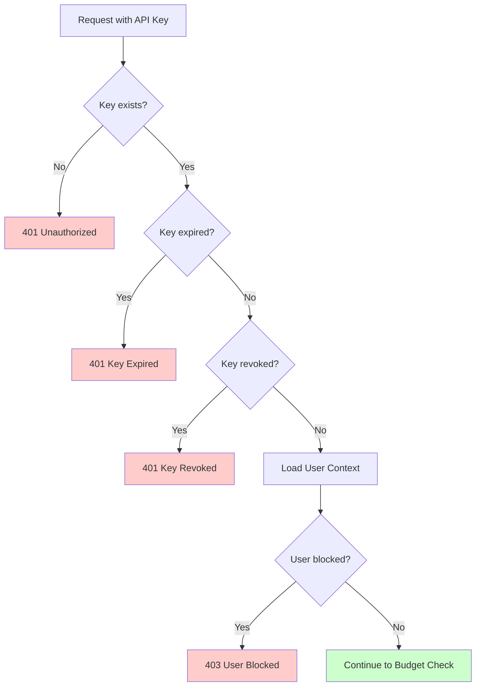
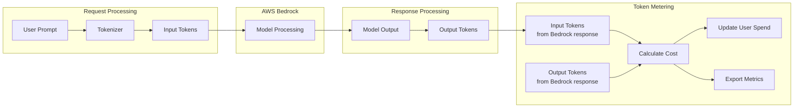
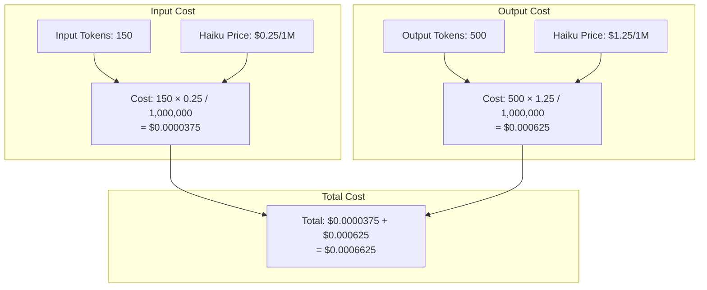
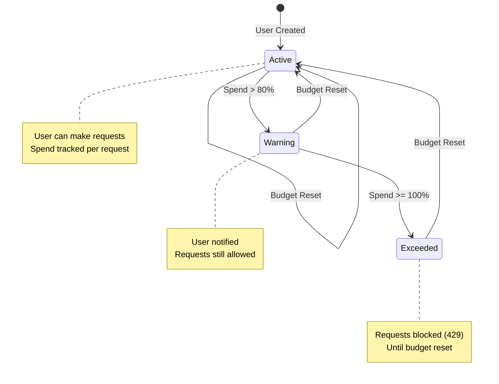
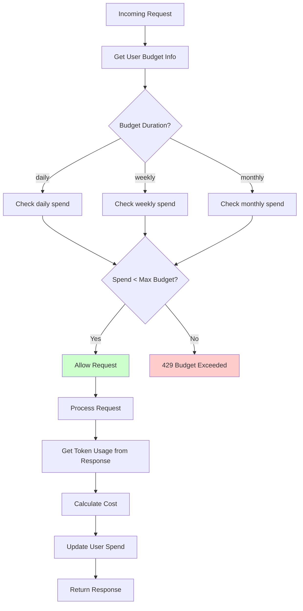
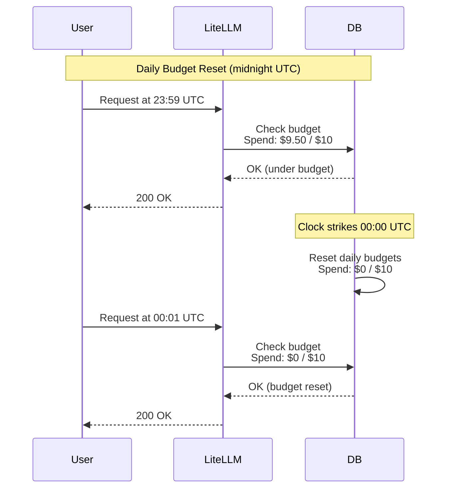
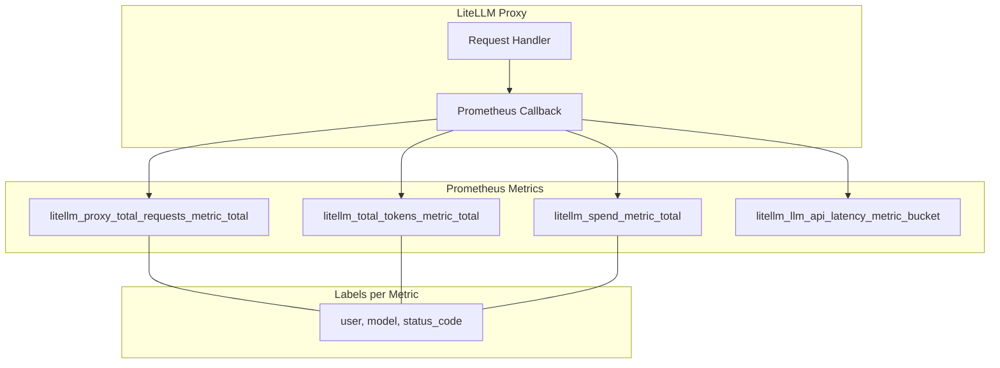
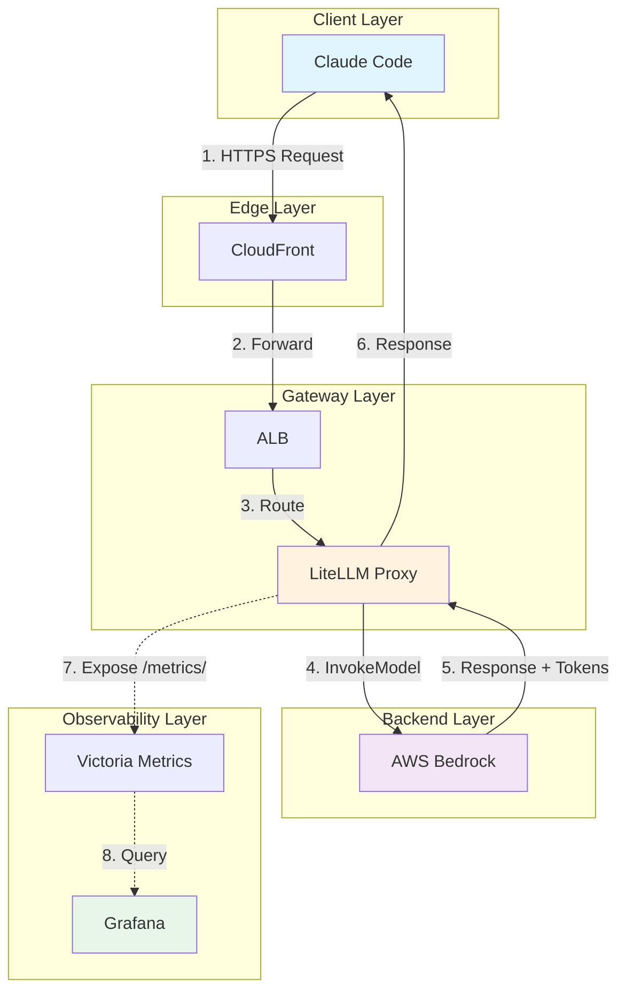

# LiteLLM Gateway - Proxy & Token Metering

Questo documento spiega come funziona il gateway LiteLLM e come vengono misurati i token per utente.

## Indice

- [Architettura Overview](#architettura-overview)
- [Flusso di una Richiesta](#flusso-di-una-richiesta)
- [Autenticazione e Utenti](#autenticazione-e-utenti)
- [Token Metering](#token-metering)
- [Budget Management](#budget-management)
- [Metriche Prometheus](#metriche-prometheus)

---

## Architettura Overview

```
┌─────────────────────────────────────────────────────────────────────────────────┐
│                              LiteLLM Gateway                                     │
│                                                                                  │
│  ┌────────────┐   ┌────────────┐   ┌────────────┐   ┌────────────┐             │
│  │   Client   │──▶│  API Key   │──▶│   Budget   │──▶│   Model    │             │
│  │  Request   │   │   Auth     │   │   Check    │   │   Router   │             │
│  └────────────┘   └────────────┘   └────────────┘   └────────────┘             │
│                                                            │                    │
│                                                            ▼                    │
│                                                     ┌────────────┐             │
│                                                     │  Bedrock   │             │
│                                                     │   Proxy    │             │
│                                                     └────────────┘             │
│                                                            │                    │
│                                                            ▼                    │
│  ┌────────────┐   ┌────────────┐   ┌────────────┐   ┌────────────┐             │
│  │  Response  │◀──│  Metrics   │◀──│   Token    │◀──│  Bedrock   │             │
│  │  to Client │   │   Export   │   │   Counter  │   │  Response  │             │
│  └────────────┘   └────────────┘   └────────────┘   └────────────┘             │
└─────────────────────────────────────────────────────────────────────────────────┘
```

---

## Flusso di una Richiesta

### Sequence Diagram Completo



---

## Autenticazione e Utenti

### Struttura Utente



### Flusso Autenticazione



---

## Token Metering

### Come Vengono Contati i Token



### Calcolo Costo



### Prezzi per Modello

| Modello | Input ($/1M tokens) | Output ($/1M tokens) | Esempio 1K tokens |
|---------|---------------------|----------------------|-------------------|
| Claude Haiku 4.5 | $0.25 | $1.25 | $0.0015 |
| Claude Sonnet 4.5 | $3.00 | $15.00 | $0.018 |
| Claude Opus 4.5 | $15.00 | $75.00 | $0.09 |

---

## Budget Management

### Ciclo di Vita del Budget



### Budget Check Flow



### Reset del Budget



---

## Metriche Prometheus

### Metriche Esportate



### Struttura Metriche

| Metrica | Tipo | Labels | Descrizione |
|---------|------|--------|-------------|
| `litellm_proxy_total_requests_metric_total` | Counter | user, model, status_code | Totale richieste |
| `litellm_total_tokens_metric_total` | Counter | user, model, type (input/output) | Totale token |
| `litellm_spend_metric_total` | Counter | user, model | Spesa in USD |
| `litellm_llm_api_latency_metric_bucket` | Histogram | model | Latenza API |

### Query PromQL Utili

```promql
# Token totali per utente (ultime 24h)
sum(increase(litellm_total_tokens_metric_total[24h])) by (user)

# Spesa per utente (ultime 24h)
sum(increase(litellm_spend_metric_total[24h])) by (user)

# Richieste per modello
sum(rate(litellm_proxy_total_requests_metric_total[5m])) by (model)

# Latenza P95 per modello
histogram_quantile(0.95,
  sum(rate(litellm_llm_api_latency_metric_bucket[5m])) by (le, model)
)

# Top 5 utenti per spesa
topk(5, sum(litellm_spend_metric_total) by (user))
```

---

## Flusso Completo: Da Request a Dashboard



### Dashboard Grafana

```
┌─────────────────────────────────────────────────────────────────────────────┐
│                        LLM Usage Overview                                    │
├─────────────────┬─────────────────┬─────────────────┬───────────────────────┤
│  Total Requests │  Total Tokens   │  Total Spend    │  Active Users         │
│     12,456      │     2.3M        │    $45.67       │       8               │
├─────────────────┴─────────────────┴─────────────────┴───────────────────────┤
│                                                                              │
│  Token Usage by User (24h)                                                   │
│  ┌────────────────────────────────────────────────────────────────────────┐ │
│  │ user_123  ████████████████████████████████████  850K                  │ │
│  │ user_456  ████████████████████████  620K                              │ │
│  │ user_789  ████████████████  480K                                      │ │
│  │ user_abc  ████████  350K                                              │ │
│  └────────────────────────────────────────────────────────────────────────┘ │
│                                                                              │
│  Spend by Model                      │  Requests Over Time                   │
│  ┌─────────────────────────────────┐ │  ┌─────────────────────────────────┐ │
│  │         ╭───╮                   │ │  │    ╱╲    ╱╲                     │ │
│  │        ╱     ╲   Haiku: 65%     │ │  │   ╱  ╲  ╱  ╲    ╱╲             │ │
│  │       ╱       ╲                 │ │  │  ╱    ╲╱    ╲  ╱  ╲            │ │
│  │      ╱ Sonnet: ╲ 30%            │ │  │ ╱            ╲╱    ╲           │ │
│  │     ╱   Opus:   ╲ 5%            │ │  │╱                    ╲          │ │
│  └─────────────────────────────────┘ │  └─────────────────────────────────┘ │
└─────────────────────────────────────────────────────────────────────────────┘
```

---

## Riepilogo

1. **Autenticazione**: API key → User lookup → Budget check
2. **Routing**: Model name mapping → Request transformation → SigV4 signing
3. **Metering**: Token count from Bedrock response → Cost calculation → Spend update
4. **Observability**: Prometheus metrics → Victoria Metrics → Grafana dashboards
