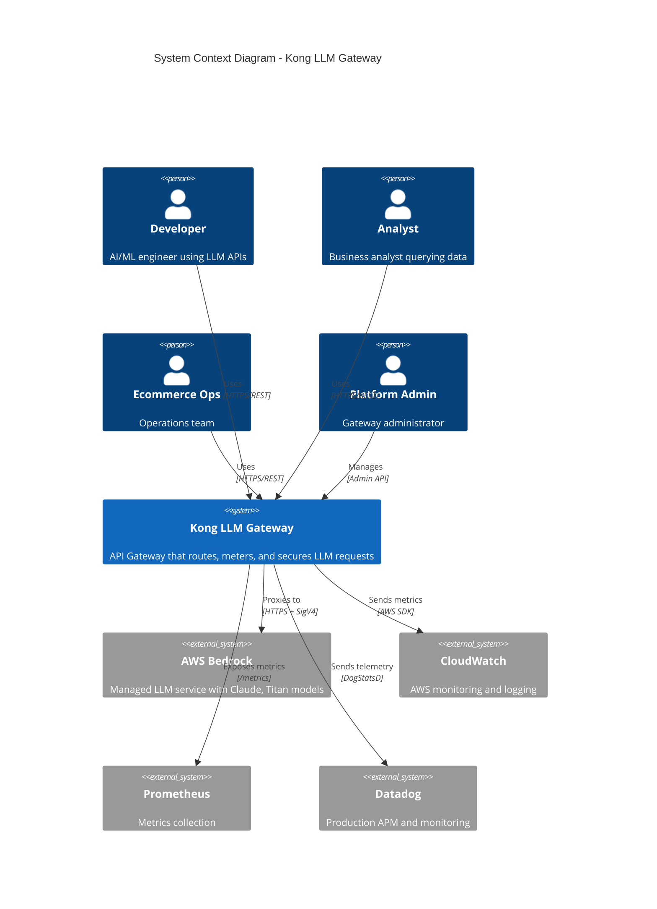
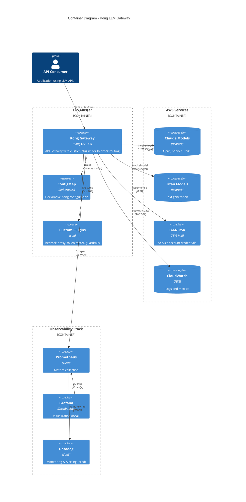
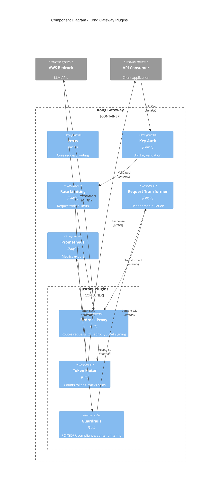
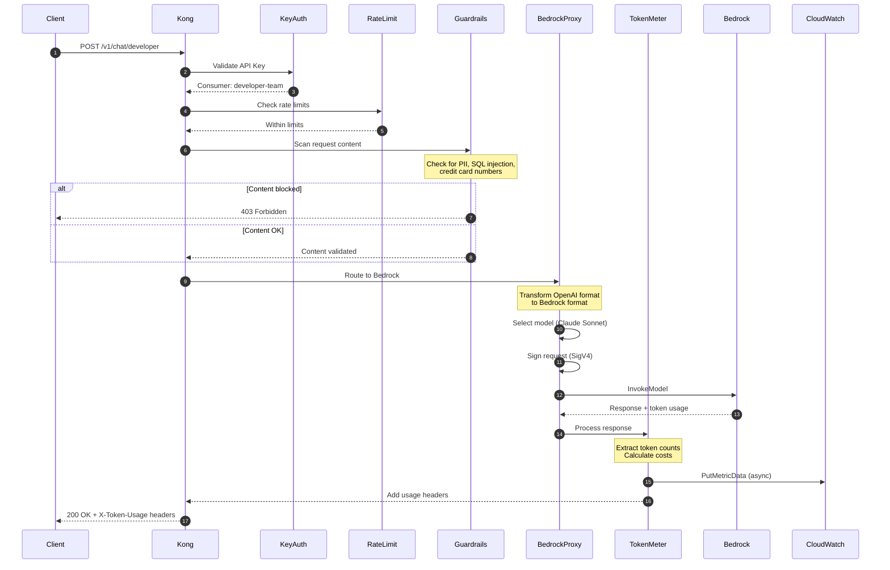
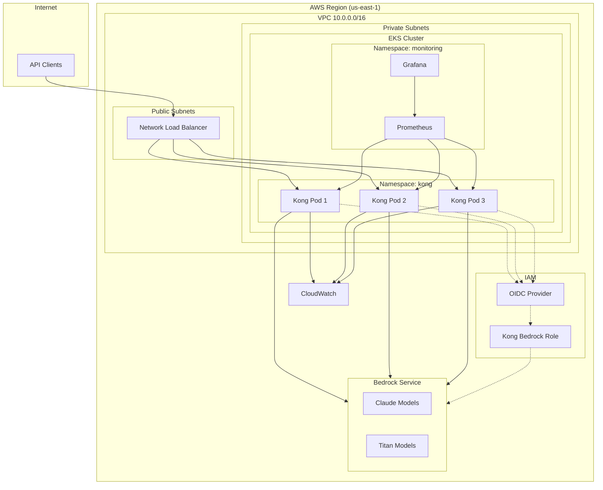
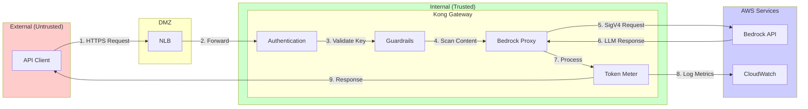
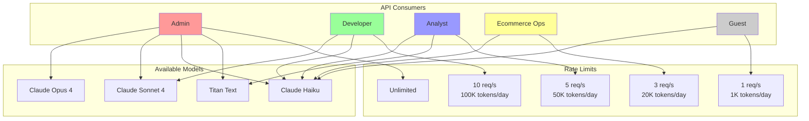

# Kong LLM Gateway - C4 Architecture

This document describes the system architecture using the C4 model (Context, Containers, Components, Code).

## Level 1: System Context Diagram

Shows the LLM Gateway in the context of its users and external systems.

## Level 2: Container Diagram

Shows the containers that make up the LLM Gateway system.

## Level 3: Component Diagram

Shows the components within Kong Gateway.

## Level 4: Code Diagram (Sequence)

Shows the request flow through the system.

## Deployment Diagram

Shows how components are deployed in AWS.

## Data Flow Diagram

Shows how data flows through the system with security boundaries.

## RBAC Model

Shows the role-based access control structure.

## Technology Stack

| Layer | Technology | Purpose |
|-------|------------|---------|
| API Gateway | Kong OSS 3.6 | Request routing, authentication, rate limiting |
| Plugins | Lua (Kong PDK) | Custom logic for Bedrock integration |
| Container | Docker / EKS | Containerized deployment |
| Infrastructure | Terraform | Infrastructure as Code |
| GitOps | ArgoCD | Kubernetes deployment automation |
| Monitoring | Prometheus + Grafana | Metrics and dashboards |
| APM | Datadog | Production monitoring |
| Cloud | AWS (EKS, Bedrock, IAM) | Managed services |
