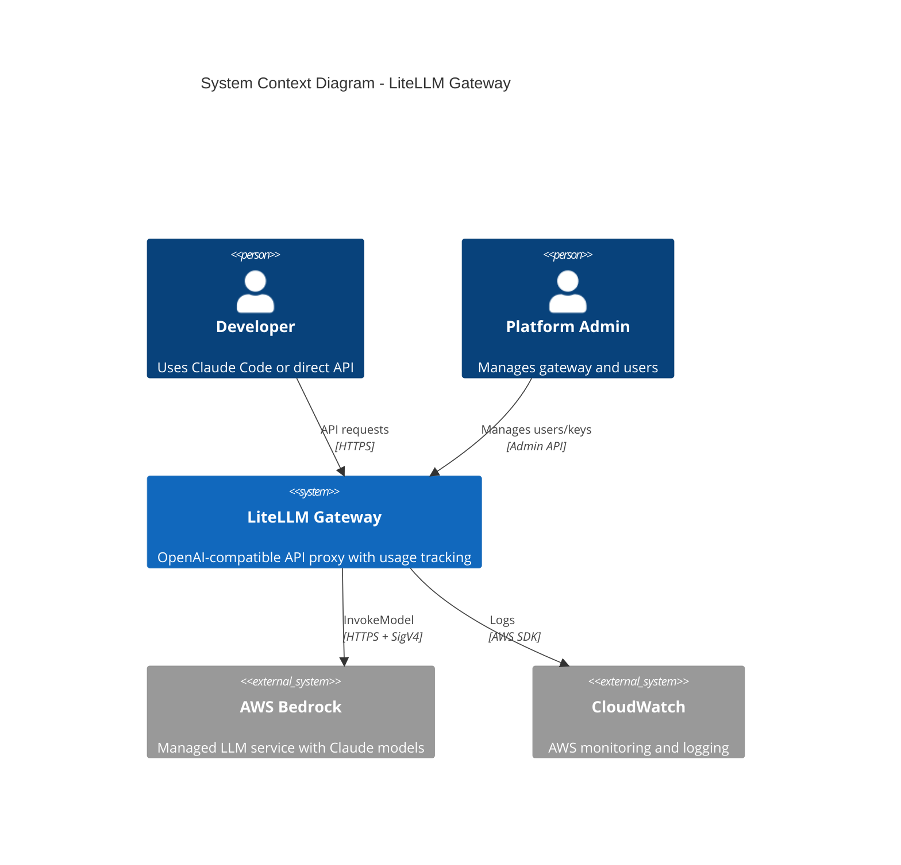
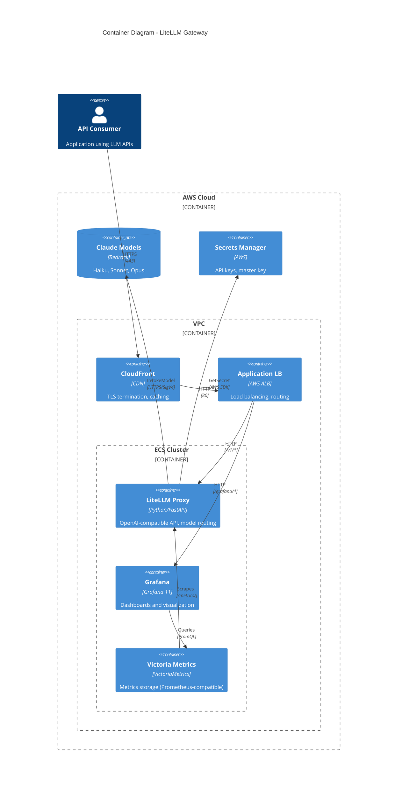
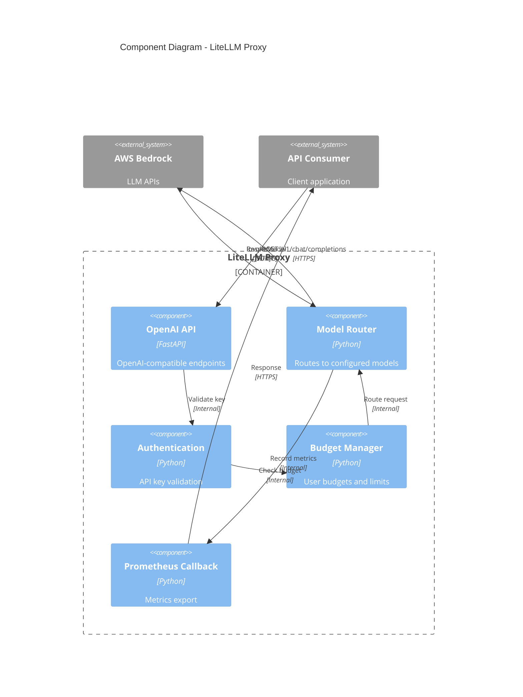
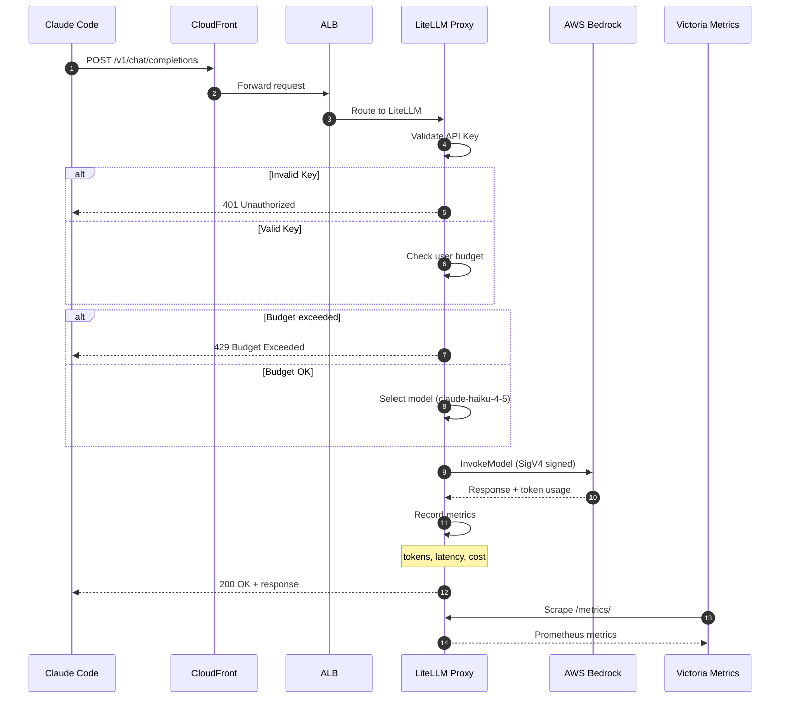
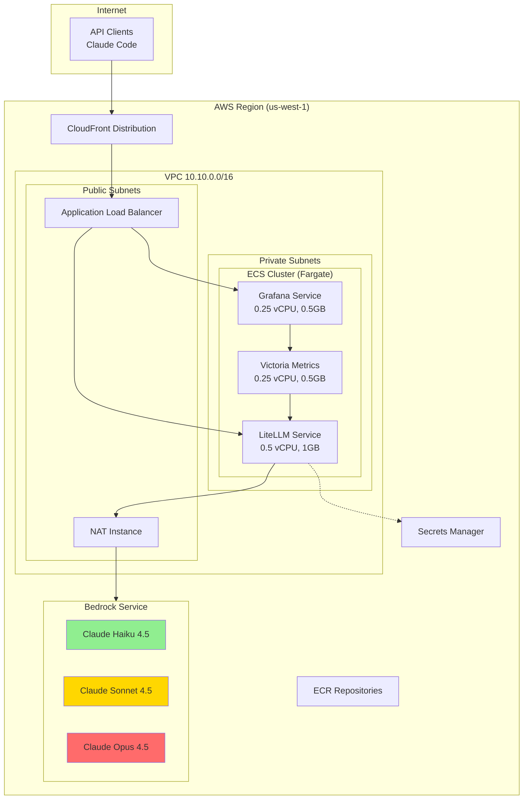
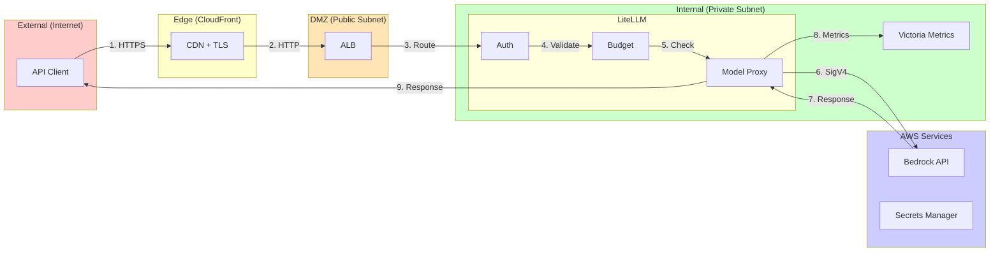
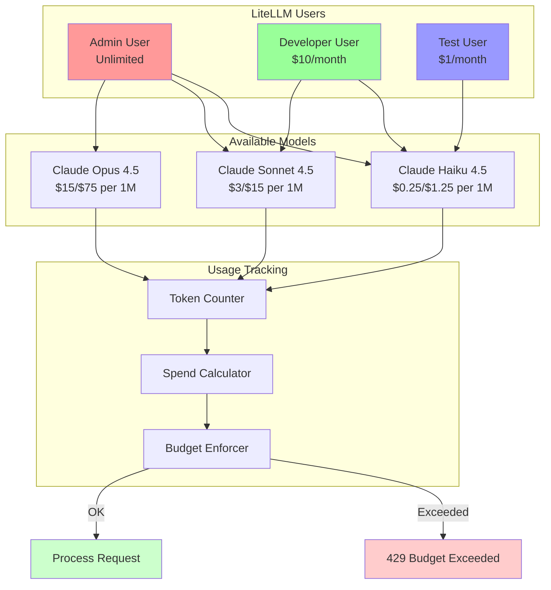

# LiteLLM Gateway - C4 Architecture

This document describes the system architecture using the C4 model (Context, Containers, Components, Code).

## Level 1: System Context Diagram

Shows the LLM Gateway in the context of its users and external systems.

## Level 2: Container Diagram

Shows the containers that make up the LLM Gateway system.

## Level 3: Component Diagram

Shows the components within LiteLLM Gateway.

## Level 4: Sequence Diagram

Shows the request flow through the system.

## Deployment Diagram

Shows how components are deployed in AWS.

## Data Flow Diagram

Shows how data flows through the system with security boundaries.

## User Budget Model

Shows how user budgets and limits work.

## Technology Stack

| Layer | Technology | Purpose |
|-------|------------|---------|
| CDN | CloudFront | TLS termination, edge caching |
| Load Balancer | ALB | Request routing, health checks |
| API Proxy | LiteLLM | OpenAI-compatible API, model routing |
| Compute | ECS Fargate | Serverless containers |
| Metrics | Victoria Metrics | Prometheus-compatible TSDB |
| Dashboards | Grafana | Visualization and alerting |
| LLM Backend | AWS Bedrock | Claude model hosting |
| Secrets | Secrets Manager | API keys, credentials |
| IaC | Terraform | Infrastructure as Code |
