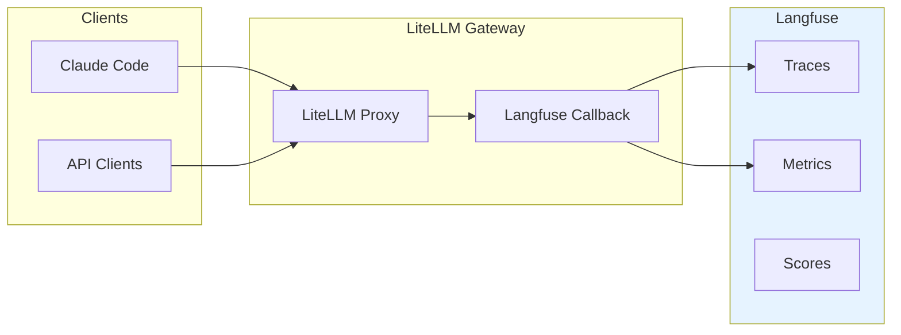
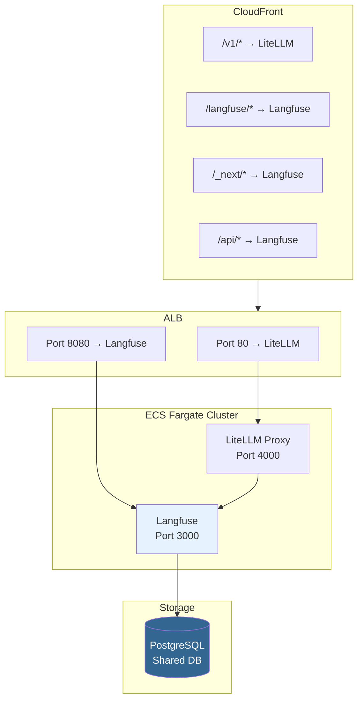
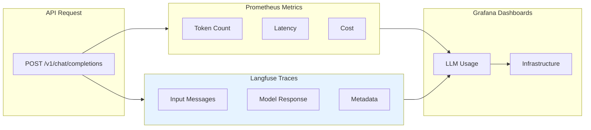

# Langfuse Integration

LLM observability and tracing for the LiteLLM Gateway using [Langfuse](https://langfuse.com/).

## Overview



## Endpoints

| Service | URL |
|---------|-----|
| **Langfuse UI** | https://d18l8nt8fin3hz.cloudfront.net/langfuse/ |
| **Langfuse API** | https://d18l8nt8fin3hz.cloudfront.net/api/ |

## Features

| Feature | Description |
|---------|-------------|
| **Trace Logging** | Complete request/response logging for all LLM calls |
| **Token Tracking** | Input/output token counts per request |
| **Latency Metrics** | End-to-end latency for each call |
| **Cost Estimation** | Estimated costs based on model pricing |
| **User Attribution** | Track usage by API key/user |
| **Model Metadata** | Model name, parameters, and settings |

## Architecture



## Configuration

### LiteLLM Callbacks

LiteLLM is configured with Langfuse callbacks in `litellm_config`:

```yaml
litellm_settings:
  callbacks:
    - prometheus
    - langfuse
  success_callback:
    - langfuse
  failure_callback:
    - langfuse
```

### Environment Variables

| Variable | Description | Source |
|----------|-------------|--------|
| `LANGFUSE_HOST` | Langfuse API endpoint | Terraform config |
| `LANGFUSE_PUBLIC_KEY` | Langfuse public key | Secrets Manager |
| `LANGFUSE_SECRET_KEY` | Langfuse secret key | Secrets Manager |

### Secrets Manager

```bash
# Langfuse API keys
arn:aws:secretsmanager:us-west-1:170674040462:secret:kong-llm-gateway-poc/langfuse-public-key-JMZGH3
arn:aws:secretsmanager:us-west-1:170674040462:secret:kong-llm-gateway-poc/langfuse-secret-key-mWJMJP
```

## Usage

### Accessing Langfuse UI

1. Open https://d18l8nt8fin3hz.cloudfront.net/langfuse/
2. Sign up (first user becomes admin)
3. Navigate to **Traces** to view LLM call logs

### Viewing Traces

Each LLM call creates a trace with:

- **Input**: User messages and system prompts
- **Output**: Model response
- **Metadata**: Model name, tokens, latency, cost
- **Status**: Success/failure

### Creating Projects

1. Go to **Settings** → **Projects**
2. Click **New Project**
3. Copy API keys for SDK integration

### Using Langfuse SDK (Optional)

For custom tracing in your applications:

```python
from langfuse import Langfuse

langfuse = Langfuse(
    secret_key="sk-lf-...",
    public_key="pk-lf-...",
    host="https://d18l8nt8fin3hz.cloudfront.net"
)

# Create a trace
trace = langfuse.trace(name="my-operation")

# Add spans
span = trace.span(name="llm-call")
# ... your LLM call ...
span.end()

trace.update(output="result")
```

## CloudFront Routing

Langfuse is served via CloudFront with path-based routing:

| Path | Origin | Description |
|------|--------|-------------|
| `/langfuse/*` | ALB:8080 | Langfuse UI (path rewritten to `/`) |
| `/_next/*` | ALB:8080 | Next.js static assets |
| `/api/*` | ALB:8080 | Langfuse API routes |

### CloudFront Function

A CloudFront Function rewrites `/langfuse/*` requests:

```javascript
function handler(event) {
  var request = event.request;
  var uri = request.uri;

  if (uri.startsWith('/langfuse')) {
    request.uri = uri.replace(/^\/langfuse/, '') || '/';
  }

  return request;
}
```

## Troubleshooting

### Langfuse UI Not Loading

```bash
# Check ECS service status
aws ecs describe-services \
  --cluster kong-llm-gateway-poc \
  --services langfuse \
  --region us-west-1 \
  --query 'services[0].{running:runningCount,desired:desiredCount}'

# Check target group health
aws elbv2 describe-target-health \
  --target-group-arn $(aws elbv2 describe-target-groups \
    --region us-west-1 \
    --query "TargetGroups[?contains(TargetGroupName, 'langfuse')].TargetGroupArn" \
    --output text) \
  --region us-west-1
```

### Traces Not Appearing

1. Check LiteLLM logs for Langfuse callback errors:
   ```bash
   aws logs tail /ecs/kong-llm-gateway-poc/litellm --follow --region us-west-1 | grep -i langfuse
   ```

2. Verify environment variables are set:
   ```bash
   aws ecs describe-task-definition \
     --task-definition kong-llm-gateway-litellm-poc \
     --region us-west-1 \
     --query 'taskDefinition.containerDefinitions[0].environment'
   ```

3. Check Langfuse API connectivity:
   ```bash
   curl -s https://d18l8nt8fin3hz.cloudfront.net/api/public/health
   # Should return: {"status":"OK","version":"..."}
   ```

### 504 Gateway Timeout

Check ALB security group allows port 8080:

```bash
aws ec2 describe-security-group-rules \
  --filter Name=group-id,Values=sg-0f8e000ebeeeac4be \
  --region us-west-1 \
  --query 'SecurityGroupRules[?FromPort==`8080`]'
```

## Costs

| Component | Monthly Cost |
|-----------|--------------|
| ECS Fargate (0.5 vCPU, 1GB) | ~$15 |
| RDS Storage (shared) | Included |
| CloudFront Requests | ~$1-2 |
| **Total Langfuse** | **~$16-17** |

## Terraform Resources

The Langfuse module creates:

| Resource | Description |
|----------|-------------|
| `aws_ecs_task_definition.langfuse` | Task definition with Langfuse container |
| `aws_ecs_service.langfuse` | ECS service running Langfuse |
| `aws_lb_listener.langfuse` | ALB listener on port 8080 |
| `aws_lb_target_group.langfuse` | Target group for health checks |
| `aws_security_group.langfuse` | Security group for ECS tasks |
| `aws_cloudwatch_log_group.langfuse` | CloudWatch log group |

## Verification (2026-01-21)

### Integration Status: ✅ VERIFIED

The Langfuse integration has been fully tested and verified.

### Test Results

**API Calls Made:**

| User | Input | Output | Cost | Latency |
|------|-------|--------|------|---------|
| Master Key | Say hello in Italian | Ciao! | $0.000049 | 0.89s |
| Master Key | Count to 3 | 1 2 3 | $0.000045 | 0.73s |
| Test User | Say hello in Spanish | ¡Hola! | $0.000049 | 1.22s |
| Test User | Count to 5 | 1 2 3 4 5 | $0.000061 | 0.72s |

**Traces Captured:** 7 total

### Query Traces via API

```bash
# Get Langfuse API keys from Secrets Manager
PUBLIC_KEY=$(aws secretsmanager get-secret-value \
  --secret-id "kong-llm-gateway-poc/langfuse-public-key" \
  --region us-west-1 --query 'SecretString' --output text)
SECRET_KEY=$(aws secretsmanager get-secret-value \
  --secret-id "kong-llm-gateway-poc/langfuse-secret-key" \
  --region us-west-1 --query 'SecretString' --output text)

# Query traces
curl -s "https://d18l8nt8fin3hz.cloudfront.net/api/public/traces?limit=10" \
  -u "$PUBLIC_KEY:$SECRET_KEY" | jq '.meta.totalItems'
```

### Grafana Integration

Langfuse traces can be correlated with Prometheus metrics in Grafana:

1. Open Grafana: https://d18l8nt8fin3hz.cloudfront.net/grafana
2. Navigate to the **LLM Usage** dashboard
3. Use the trace ID from Langfuse to correlate with request metrics



## Related Documentation

- [LiteLLM Langfuse Integration](https://docs.litellm.ai/docs/observability/langfuse)
- [Langfuse Self-Hosting](https://langfuse.com/docs/deployment/self-host)
- [User Management](user-management.md)
- [Architecture](architecture/c4-architecture.md)
