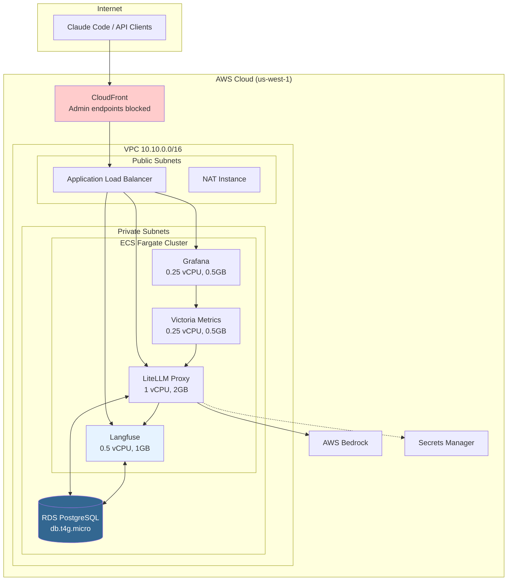
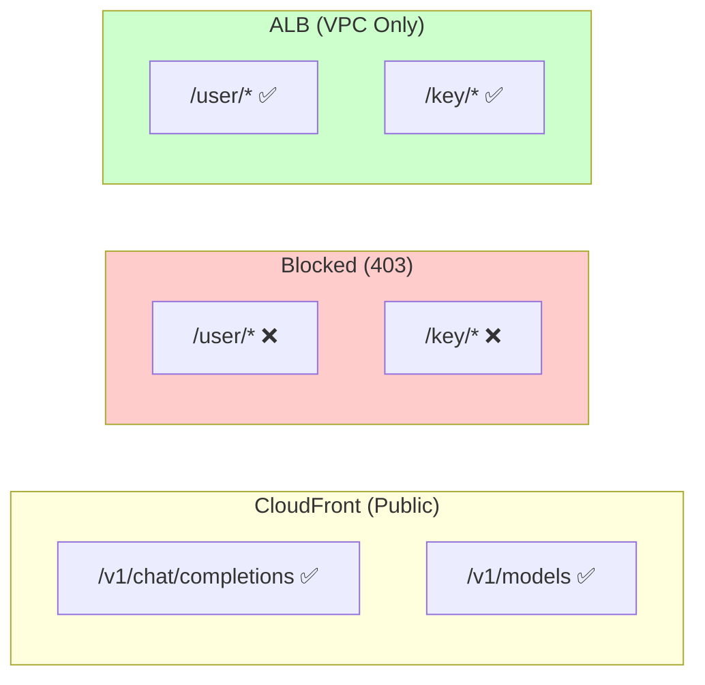
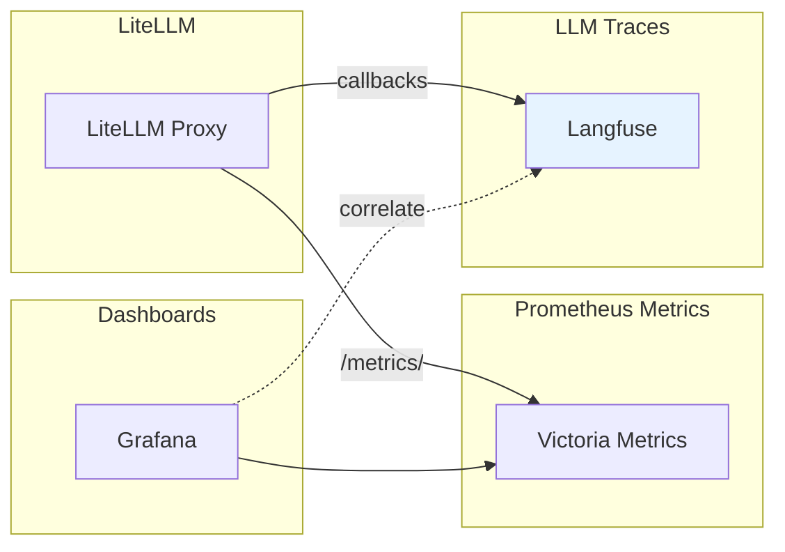

# LiteLLM Gateway - POC Environment

Low-cost Proof of Concept deployment using AWS ECS Fargate with PostgreSQL for user management and Langfuse for LLM observability.

## Architecture



## Estimated Costs

| Component | Service | Monthly Cost |
|-----------|---------|--------------|
| LiteLLM | ECS Fargate (1 vCPU, 2GB) | ~$30 |
| Langfuse | ECS Fargate (0.5 vCPU, 1GB) | ~$15 |
| Grafana | ECS Fargate (0.25 vCPU, 0.5GB) | ~$8 |
| Victoria Metrics | ECS Fargate (0.25 vCPU, 0.5GB) | ~$8 |
| PostgreSQL | RDS (db.t4g.micro) | ~$12 |
| Network | NAT Instance (t4g.nano) | ~$3 |
| CDN | CloudFront | ~$1-5 |
| **Total Fixed** | | **~$75-80** |
| LLM Usage | Bedrock (Haiku/Sonnet/Opus) | Pay per use |

**Note**: Actual costs depend on usage. PostgreSQL enables full user management with budget tracking. Langfuse provides LLM call tracing and observability.

## Quick Start

### 1. Prerequisites

- AWS CLI configured
- Terraform >= 1.5.0
- Docker (for building Grafana image)

### 2. Configure

```bash
cd infra/terraform/environments/poc

# Copy and customize variables
cp terraform.tfvars.example terraform.tfvars
vim terraform.tfvars
```

Required secrets in AWS Secrets Manager:
```bash
# LiteLLM master key
aws secretsmanager create-secret \
  --name litellm-poc/master-key \
  --secret-string "sk-litellm-your-master-key"

# Grafana admin password
aws secretsmanager create-secret \
  --name kong-llm-gateway/grafana-admin-password \
  --secret-string "your-grafana-password"
```

### 3. Deploy

```bash
# Initialize
terraform init

# Plan
terraform plan -out=tfplan

# Apply
terraform apply tfplan
```

### 4. Build and Push Grafana Image

```bash
cd ../../grafana

# Login to ECR
aws ecr get-login-password --region us-west-1 | \
  docker login --username AWS --password-stdin <ACCOUNT_ID>.dkr.ecr.us-west-1.amazonaws.com

# Build and push
docker build --platform linux/amd64 -t <ACCOUNT_ID>.dkr.ecr.us-west-1.amazonaws.com/grafana-llm-gateway:latest .
docker push <ACCOUNT_ID>.dkr.ecr.us-west-1.amazonaws.com/grafana-llm-gateway:latest
```

### 5. Test

```bash
# Get outputs
terraform output

# Test health endpoint
curl $(terraform output -raw cloudfront_domain)/health/liveliness

# Test chat completion
curl -X POST "$(terraform output -raw cloudfront_domain)/v1/chat/completions" \
  -H "Content-Type: application/json" \
  -H "Authorization: Bearer <YOUR_API_KEY>" \
  -d '{"model":"claude-haiku-4-5","messages":[{"role":"user","content":"Hello"}],"max_tokens":50}'

# Open Grafana
open "https://$(terraform output -raw cloudfront_domain)/grafana"
```

## Configuration

### Using Existing VPC

Set `create_vpc = false` and provide VPC details:

```hcl
create_vpc         = false
vpc_id             = "vpc-xxxxxxxxx"
private_subnet_ids = ["subnet-aaaa", "subnet-bbbb"]
public_subnet_ids  = ["subnet-cccc", "subnet-dddd"]
```

### HTTPS

CloudFront provides HTTPS by default. For custom domain:

```hcl
certificate_arn = "arn:aws:acm:us-east-1:123456789:certificate/xxxxx"
```

### Adding Models

Edit `litellm_config` in `main.tf`:

```yaml
model_list:
  - model_name: claude-haiku-4-5
    litellm_params:
      model: bedrock/anthropic.claude-3-5-haiku-20241022-v1:0
      aws_region_name: us-west-1
  - model_name: claude-sonnet-4-5
    litellm_params:
      model: bedrock/anthropic.claude-sonnet-4-5-20250514-v1:0
      aws_region_name: us-west-1
```

## User Management

### Security Model

Admin endpoints are **blocked from CloudFront** for security:



### Using the Management Script

```bash
cd scripts/

# Create user
./litellm-users.sh create-user --email user@example.com --budget 50

# Generate API key
./litellm-users.sh create-key --alias "user-laptop" --budget 10

# List users
./litellm-users.sh list-users
```

### Manual API Access (VPC Only)

Admin endpoints require ALB direct access from within the VPC:

```bash
# Create user (via ALB from VPC)
curl -X POST "http://<alb-dns-name>/user/new" \
  -H "Authorization: Bearer <MASTER_KEY>" \
  -H "Content-Type: application/json" \
  -d '{
    "user_email": "user@example.com",
    "max_budget": 10.0,
    "budget_duration": "monthly"
  }'

# Generate API key (via ALB from VPC)
curl -X POST "http://<alb-dns-name>/key/generate" \
  -H "Authorization: Bearer <MASTER_KEY>" \
  -H "Content-Type: application/json" \
  -d '{
    "user_id": "<USER_ID>",
    "key_alias": "user-laptop"
  }'

# Via CloudFront - BLOCKED
# curl -X POST "https://<cloudfront-domain>/user/new" -> 403 Forbidden
```

## Observability (Verified ✅)

### Monitoring Stack



### Endpoints

| Service | URL | Purpose |
|---------|-----|---------|
| **Grafana** | `/grafana` | Metrics dashboards |
| **Langfuse** | `/langfuse/` | LLM trace viewer |
| **Metrics** | `/metrics/` | Prometheus metrics |

### Verified Metrics

| Metric | Description |
|--------|-------------|
| `litellm_proxy_total_requests_metric` | Total requests per user |
| `litellm_total_tokens_metric` | Token usage (input + output) |
| `litellm_spend_metric` | Cost tracking per user |
| `litellm_llm_api_latency_metric` | Request latency |

### Langfuse Traces

Each LLM call is logged with:
- Full request/response content
- Token counts and costs
- Latency measurements
- User attribution

Access: https://d18l8nt8fin3hz.cloudfront.net/langfuse/

## Cleanup

```bash
terraform destroy
```

## Outputs

| Output | Description |
|--------|-------------|
| `cloudfront_domain` | CloudFront distribution domain |
| `alb_dns_name` | ALB DNS name (internal) |
| `grafana_url` | Grafana dashboard URL |
| `langfuse_url` | Langfuse trace viewer URL |
| `ecs_cluster_name` | ECS cluster name |

## Troubleshooting

### LiteLLM not responding
```bash
# Check ECS service
aws ecs describe-services --cluster kong-llm-gateway-poc --services litellm --region us-west-1

# Check logs
aws logs tail /ecs/litellm --follow --region us-west-1
```

### Metrics not appearing
```bash
# Check Victoria Metrics is scraping
curl "https://<cloudfront-domain>/metrics/"

# Check Victoria Metrics targets
aws logs tail /ecs/victoria-metrics --follow --region us-west-1
```

### Grafana login issues
- Default user: `admin`
- Password: From Secrets Manager (`kong-llm-gateway/grafana-admin-password`)

### Langfuse not loading
```bash
# Check ECS service
aws ecs describe-services --cluster kong-llm-gateway-poc --services langfuse --region us-west-1

# Check logs
aws logs tail /ecs/kong-llm-gateway-poc/langfuse --follow --region us-west-1

# Check ALB target health
aws elbv2 describe-target-health \
  --target-group-arn $(aws elbv2 describe-target-groups \
    --region us-west-1 \
    --query "TargetGroups[?contains(TargetGroupName, 'langfuse')].TargetGroupArn" \
    --output text) \
  --region us-west-1
```

### Langfuse traces not appearing
1. Check LiteLLM callbacks are configured:
   ```bash
   aws logs tail /ecs/kong-llm-gateway-poc/litellm --region us-west-1 | grep -i langfuse
   ```

2. Verify Langfuse API is reachable:
   ```bash
   curl -s https://d18l8nt8fin3hz.cloudfront.net/api/public/health
   # Expected: {"status":"OK","version":"..."}
   ```
